# 对话学习报告：vLLM Router Replay 现状 · H.X.(#39568) 与 NV(#39917) 两套重构方案

> Sources：
> - 微信群聊截图（申奥 / 网名是何不凡 即 俊杰/Joel / H.X. / 共 ~50 条消息，2026-04-15 ~ 2026-04-16）
> - vLLM 当前 main 代码 `vllm/model_executor/layers/fused_moe/routed_experts_capturer.py`、`vllm/v1/core/sched/scheduler.py`
> - vLLM PR #39568（H.X. / xhx1022）、PR #39917（TomerBN-Nvidia）
> - vLLM RFC #38079（junjzhang / 何不凡，DP+EP hang）、RFC #39701（TomerBN-Nvidia，device cache 方案）
> - verl PR #4101（R2/R3 Router Replay 支持，litianjian 提、ISEEKAN 合并）、PR #6029（partial rollout concat bug fix）
>
> Participants：申奥（Scaffold / vLLM infra 侧发起者）、网名是何不凡（= 俊杰 = Joel = junjzhang，veRL RL 训练侧）、H.X.（= Hongxin Xu，vLLM 侧改造 PR 作者）
>
> Analysis depth：standard（交叉验证代码 + 对齐 PR/RFC 原文，未做深度 Web 研究）

## 一图看懂整个故事

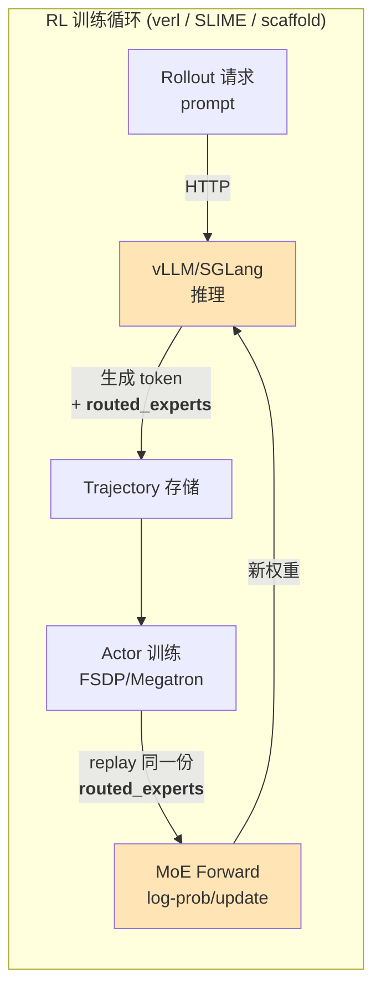

**核心诉求**：rollout 和训练两边的 MoE **expert 路由决策必须完全一致**，否则 on-policy 的 KL/PPO loss 会漂掉。`routed_experts` 是一份 shape `(seq_len, num_layers, topk)` 的 int 张量，记录每 token 每层选中的 expert id，专门用来让训练 forward 走和推理一模一样的 expert 子图。

---

## 三套方案的定位（一眼对比）

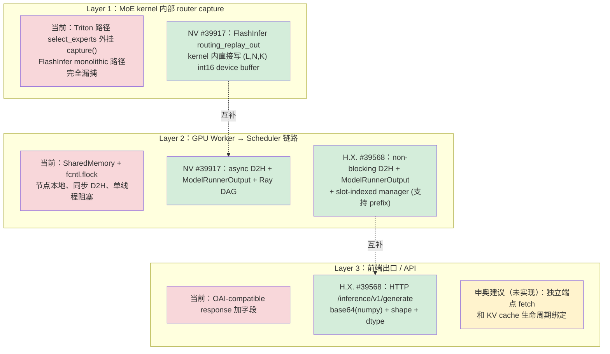

- **红**：当前上游的问题点；**绿**：已有 PR 提供的解法；**黄**：讨论中但未开工。
- **关键发现**：**NV 和 H.X. 打的是不同层**——NV 在 Layer 1（kernel / CUDA Graph），H.X. 在 Layer 2/3（IPC / 前端）。俊杰的评价原话："nv 那个还是再优化 capture 那边的，frontend 这块还是 H.X. 设计的好"。

---

## TL;DR

- **问题背景**：vLLM 的 `--enable-return-routed-experts`（源于 SGLang，用于 MoE RL 训练做 router replay）当前用 SharedMemory + `fcntl` 文件锁 + `capture()` 回调把 topk_ids 从 Worker 送给 Scheduler，**在 CUDA Graph / 多机 / MTP / prefix caching / FlashInfer monolithic kernel 上都有硬伤**，DP+EP 跑 20–60s 就 NCCL 超时 hang。
- **两套重构路线并行**：H.X.（#39568）聚焦**前端数据链路**——干掉 shm/flock，直接走 `ModelRunnerOutput`，加 HTTP `/inference/v1/generate` 出口、支持 abort、并用 slot-indexed manager 兼容 prefix cache；NV（#39917，对应 RFC #39701）聚焦 **GPU Worker Process 内核与 CUDA Graph**——device cache `(L,N,K) int16` + `cudagraph_mark_tensor_static` + 异步 D2H + FlashInfer `routing_replay_out` 打通 monolithic 路径 + `-1` 哨兵区分 prefix hit。
- **群里的共识**：两 PR 解决不同层次的问题，互补而非替代。H.X. 的 frontend/IPC 设计被俊杰认可；NV 的 capture/CUDA Graph/flashinfer 优化被认为更深层；申奥主动认领：**把两者缝合 + 解耦 capture 与 fetch，fetch 走独立端点、不再挂在 OAI-compatible 响应上，语义与 KV cache 生命周期绑定（"拷打 mooncake"）**。
- **关键 RL 语义确认**：vLLM 每次都返回**全量 token 的 router**（不管是否 abort），partial rollout 的历史版本拼接策略交给 RL 框架决策；SGLang/SLIME 现在用的是"最新权重生成的 router"；verl partial rollout 路径因为 SGLang 一次返回全量而**必须 replace 而不是 concat**（verl #6029 bug）。
- **已验证 vs 待验证（按 H.X. 4/15 15:38）**：Qwen3 dp+ep 跨机 ✅、rl diff/速度 ✅、prefix+cudagraph ✅、mtp+cuda graph+prefix ✅、TP16/跨机 ✅；**flashinfer ❌（会崩 on cuda graph）**，**PP ❌**，Qwen3.5(linear) 已通过。

## 主题总览 / Topic Overview

| # | 主题 | 对话占比 | 主要参与人 | 结论 |
|---|------|---------|-----------|------|
| 1 | 当前 vLLM router replay 实现的硬伤 | ~10% | 何不凡、H.X.、申奥 | 明确"当前设计有问题"，指向 #38079 |
| 2 | H.X. 的 PR #39568 替代方案（去 shm、HTTP 出口、abort） | ~25% | H.X.、何不凡 | 方向认可，已合入 verl #4101 依赖链路 |
| 3 | NV PR #39917 / RFC #39701（device cache + flashinfer） | ~15% | 申奥、何不凡、H.X. | 何不凡评价"优化 capture 那边"；留给申奥对齐 NV |
| 4 | RL 语义：partial rollout 用哪个版本的 router | ~15% | Joel、H.X. | 先用"最新权重"的 router；vllm 每次返回全量 |
| 5 | 耦合/解耦：capture vs fetch；端点 vs 挂 OAI 响应 | ~15% | 申奥、何不凡、H.X. | 理想：解耦，独立 fetch 端点，生命周期绑 KV；但短期 H.X. 方案"挂响应"务实可用 |
| 6 | 矩阵：MTP / PP / flashinfer / 跨机 / DP+EP 支持面 | ~15% | H.X. | flashinfer on cuda graph ❌，PP ❌，其余都 ✅ |
| 7 | "神之方案"：拷打 mooncake，与 KV cache 生命周期绑定 | ~5% | 何不凡、申奥 | 玩笑成分大，但方向值得认真考虑 |

## 核心知识点 / Key Knowledge Points

### 1. 什么是 Router Replay，为什么 MoE RL 需要它

**背景**：MoE 模型每层的 router 决定 token 走哪几个 expert（topk_ids）。在 GRPO / RLHF 这类 on-policy RL 里，**rollout 阶段**用推理引擎生成 trajectory，**训练阶段**用 actor（FSDP/Megatron）重算 log-prob / policy update；如果训练和 rollout 的 router 决策不一致（例如因为权重版本、batch 组合、FP8/BF16 精度差异），就会给 loss 带来偏差。

**两种模式**（verl #4101 R2/R3 术语，参考论文 2510.11370 / 2507.18071）：
- **R2 (Router Replay)**：训练侧在 log-prob 计算时**记录** router 选择，policy update 时**重放**同一份选择。
- **R3 (Rollout Router Replay)**：rollout（vLLM / SGLang）阶段**记录** router 选择，整段 RL 后训练一直**重放**这份选择。vLLM 侧的 `--enable-return-routed-experts` 服务的就是 R3。

**为什么需要从 vLLM 捕获**：rollout 跑在 vLLM/SGLang，训练侧看不到 vLLM 真实 batch 内的 router 选择；拿不到这份数据就没法让 training forward 走完全一致的 expert 路径。

### 2. 当前上游实现（SharedMemory + file lock）及其硬伤

**代码指针**：`vllm/model_executor/layers/fused_moe/routed_experts_capturer.py:29,47-77`（`_file_lock` / `_create_or_attach_shared_memory`），`vllm/v1/core/sched/scheduler.py:30-31,259-291,1602-1625`（`RoutedExpertsReader` + `_get_routed_experts`）。

**架构（序列图）**：

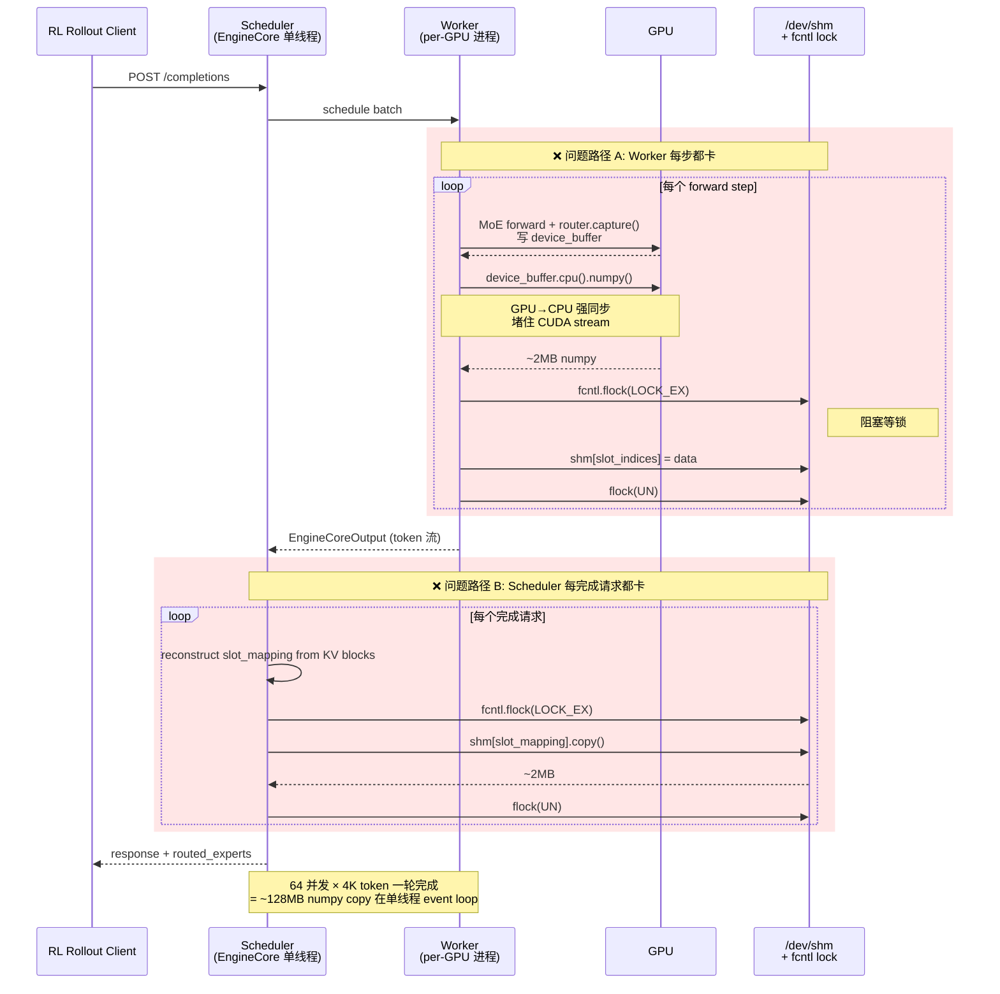

**两份 RFC 列出的 8 个硬伤**（#38079 junjzhang 事故复盘 + #39701 NV 系统梳理）：

| # | 问题 | 后果 |
|---|------|------|
| 1 | CUDA Graph 不兼容：device buffer 没做 `cudagraph_mark_tensor_static`，graph 会 snapshot/restore，覆盖 graph 外的 `clear_buffer()` | 位置残留旧快照，不等于零 |
| 2 | Monolithic kernel 不被 capture（`apply_monolithic()` 绕过 router） | FP8/MXFP8 默认路径完全拿不到 router |
| 3 | SharedMemory 是节点本地 | 多机（400B+）场景 scheduler 根本读不到其他节点的 shm |
| 4 | 没处理 MTP 推测 token（需要按 accepted tokens trim） | MTP 模式 router 和 token 对不上 |
| 5 | prefix cache hit 的位置 host buffer 被 fill(0)，而 expert 0 也是合法值 | 无法区分"hit"和"真的路由到 0" |
| 6 | `.cpu().numpy()` 同步 D2H + flock | 每 step 阻塞 CUDA stream 和单线程 event loop |
| 7 | Buffer layout `(N,L,K) int32` | FlashInfer `routing_replay_out` 需要 `(L,N,K)` 连续切片 |
| 8 | int32 冗余，其实 int16 就够 | 2× 内存浪费 |

**junjzhang 的事故证据（#38079）**：gpt-oss-120B，TP=8 DP=2 EP=16 × 2 nodes，开启后 20–60s hang，throughput 掉 0，requests 卡在 Running，最终 EP group NCCL ALLREDUCE 超时。通过一张消融表定位到 **Worker 侧的 `.cpu()` 强同步**和 **Scheduler 侧的 `fcntl.flock` + numpy memcpy** 两条路径各自独立就能让整个 EP 集合通信撕裂——因为任何一个 DP Worker 慢，all-to-all 就 timeout。

**DP + EP hang 级联图**：

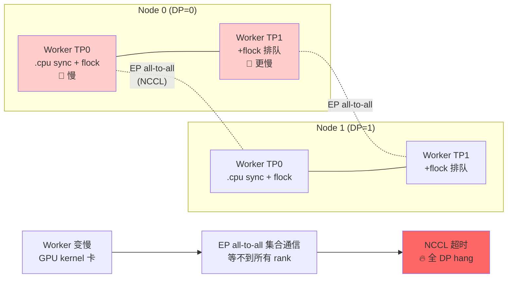

**关键洞察**：DP 之间本来是弱耦合的，但 **EP 把他们通过 all-to-all 强耦合了**——任何一个 rank 慢就会把整个 collective 拉超时。这就是为什么 router replay 这个"看起来只是拷点数据"的 feature 会击穿整个 EP 大模型服务。

**消融定位表（#38079 原文）**：

| 实验 | Worker 写 shm | Scheduler 读 shm | 结果 |
|------|---------------|------------------|------|
| Baseline (flag=False) | off | off | **OK** 持续吞吐 |
| Flag=True, 默认 | 每 step | 每完成请求 | **~20s HANG** |
| save=no-op, read active | off | 每完成请求 | **~20s HANG** |
| save active, read=None | 每 step | off | **~60s HANG** |
| save=off, read=None | off | off | **OK** |

**写路径**和**读路径**各自独立就能让 EP 超时——这意味着**只修其中一边是不够的**，两边都要干净掉 shm/flock 和同步 D2H。

### 2.5 CUDA Graph 不兼容 · 原理深挖（重点）

> 关键澄清：**vLLM 当前全仓 0 处用 `mark_static_address`**（grep 验证）。下面解释的不是"大部分 tensor 不需要 mark、偏偏 device_buffer 需要 mark"，而是——**vLLM 整体走的是一条不需要 mark 的路，device_buffer 因为落到了 torch.compile 那条子路上才出问题**。

#### (0) vLLM 的 CUDA Graph 机制和 torch.compile 的是两套（先定位）

vLLM 对外部 tensor 的要求和 torch.compile 相反：

| | torch.compile + cudagraph_trees | vLLM 自己的 CUDAGraphWrapper |
|---|---|---|
| 对外部 tensor 指针的假设 | **可能变**，默认 copy-in/copy-out | **必须稳定**，零 copy |
| 不稳定指针的处理 | `mark_static_address` 告诉编译器"这个稳定" | 不允许——debug 模式直接 `assert data_ptr 不变` |
| 约束落点 | compile 层（torch 内部） | 调用方（vLLM gpu_model_runner） |

源码证据（`vllm/compilation/cuda_graph.py`）：

```python
# 第 161-167 行 docstring
# "CUDAGraphWrapper does not store persistent buffers or copy any
#  runtime inputs into that buffers for replay. We assume implementing
#  them is done outside of the wrapper."

# 第 283 行：原生 API，不走 torch._dynamo
cudagraph = torch.cuda.CUDAGraph()

# 第 308-314 行：手动 capture，没有 copy-in 层
with torch.cuda.graph(cudagraph, pool=self.graph_pool, stream=current_stream()):
    output = self.runnable(*args, **kwargs)

# 第 343-350 行：replay 时 debug 校验
new_input_addresses = [x.data_ptr() for x in args if isinstance(x, torch.Tensor)]
assert new_input_addresses == entry.input_addresses, "输入地址变了"
```

vLLM 怎么实际落实"指针稳定"？`gpu_model_runner.py:672-694` 启动时预分配一堆 persistent buffer：

```python
# Persistent buffers for CUDA graphs.
self.input_ids       = self._make_buffer(self.max_num_tokens, dtype=torch.int32)
self.positions       = torch.zeros(self.max_num_tokens, dtype=torch.int64, device=self.device)
self.query_start_loc = self._make_buffer(self.max_num_reqs + 1, dtype=torch.int32)
self.seq_lens        = torch.zeros(self.max_num_reqs, dtype=torch.int32, device=self.device)
# ... 等等
```

每次 forward 前，外部代码 `copy_()` **就地改写内容、指针不变**；replay 时 kernel 仍然读同一块内存，但内容是新 batch 的。

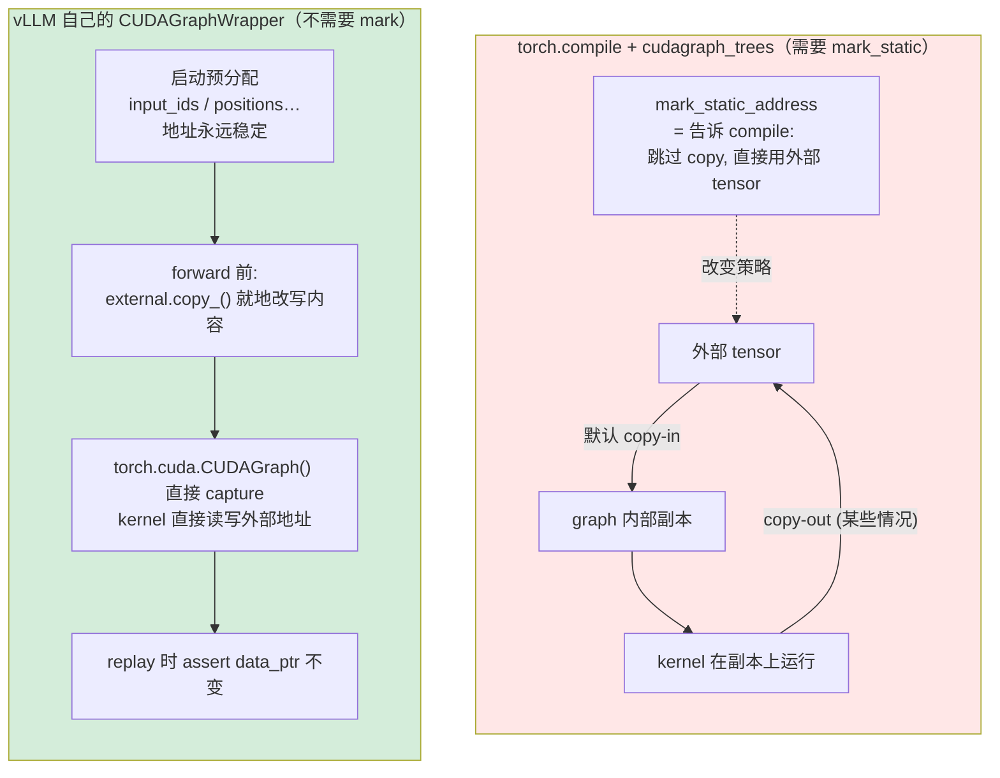

**结论**：vLLM 自己的 CUDAGraphWrapper 路径**根本不碰 `mark_static_address` 这个概念**，靠 "调用方保证指针稳定 + 预分配 + copy_()" 三件套解决。所以它全仓 0 处用这个 API 是**合乎设计的**，不是漏洞。

#### (0.5) 但 vLLM 同时跑两种 cudagraph 模式

- **FULL 模式**：整个 model forward 打一张 graph，走**原生 `torch.cuda.CUDAGraph`**（上面 VL 那条路）
- **PIECEWISE 模式（vLLM 默认）**：`torch.compile` 把 forward 切成子图，每个子图在自己的 cudagraph 里跑——**这条路落到 torch.compile + cudagraph_trees（TC 那条路）**

关键事实：**MoE forward 是 piecewise 子图的一部分**。`base_router.py:281` 里 `capture_fn(topk_ids)` 发生在 piecewise 子图内部，它访问的 `self._device_buffer` 被 inductor 当作**子图 closed-over 的外部 tensor**。

到这里问题才真正出现：**既然落在 TC 路径上，就得遵循 TC 的游戏规则**——要么被 cudagraph_trees 当作"指针可能变"的输入 copy 一份、要么显式 mark。

#### (1) CUDA Graph 捕获的是"指针 + 操作序列"，不是"值"

这是任何 cudagraph 的底层事实，不分 raw 还是 torch.compile：

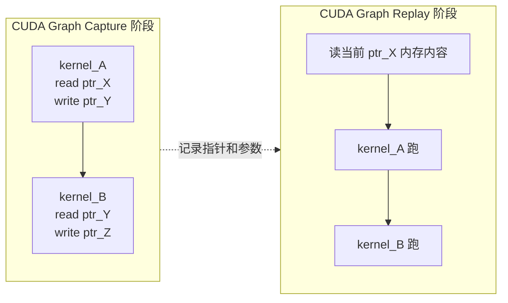

Replay 时读到什么、写到什么，**完全看那些地址当下是什么**。底层没有"snapshot"，"snapshot" 是 cudagraph_trees 在上层做的内存管理术语。

#### (2) `torch._dynamo.mark_static_address` 的真实语义

从 torch 源码 docstring：

> *Marks an input tensor whose address should be treated as constant across calls to the same dynamo-compiled function. This indicates to cudagraphs that **an extra allocation is not needed for this input**.*

翻译：**torch.compile 默认认为外部 tensor 指针可能变**，所以在 graph 里自己复制一份管理；`mark_static_address` 就是明确告诉它"别复制、别管理，我保证指针稳定"。

这是 **torch.compile 那条路的 API**，vLLM 自己的 raw CUDAGraphWrapper **完全不涉及**。

#### (1) CUDA Graph 捕获的是"指针 + 操作序列"，不是"值"


**Graph 不保存数据**，只保存"在这些地址上、按这个顺序、跑这些 kernel"。Replay 时读到什么、写到什么，**完全看那块内存当下是什么**。

#### (2) `torch._dynamo.mark_static_address` 的真实语义

刚从 torch 源码查到的 docstring：

> *Marks an input tensor whose address should be treated as constant across calls to the same dynamo-compiled function. This indicates to cudagraphs that **an extra allocation is not needed for this input**.*

翻译：**不 mark 的话，torch.compile + cudagraph 会认为外部 tensor 指针可能每次调用都变，于是在 graph 里复制一份自己管**。

```
默认（未 mark）：                              有 mark_static_address：

  外部 tensor ──┐                              外部 tensor ──┬──> kernel 读写
               │ copy-in                                    │   （同一块内存）
               ▼                                            │
  graph 内部副本 ── kernel 读写                              └── 外部读/clear_buffer
               │
               │ copy-out（某些情况）
               ▼
  外部 tensor
```

#### (3) 为什么 vLLM 平时的 tensor 不用 mark、router buffer 却要

**不是"大部分 tensor 不需要 mark、少数需要 mark"的二元分类**——vLLM 全仓都不 mark。正确的分类是：**tensor 落在哪条 cudagraph 路径上，以及它的访问模式是否和那条路径的假设兼容**：

| tensor | 落在哪条路 | 是否兼容路径假设 | 处理 |
|--------|-----------|-----------------|------|
| `input_ids`, `positions`（persistent batch） | vLLM raw CUDAGraph | ✅ 指针稳定，外部 `copy_()` 改内容 | 什么都不用做 |
| 模型权重 `Linear.weight` | 跨路径（piecewise 子图里也会用） | ✅ 内容稳定、指针稳定 | 什么都不用做 |
| MoE 中间 activation | piecewise 子图内部 | ✅ 每次完全覆写，历史值无意义 | 什么都不用做 |
| `KV cache` tensor | piecewise 子图内 + 外部读写 | ✅ 位置索引由外部 attention 算子明确指定，不依赖"整块一致性" | 什么都不用做 |
| **router `device_buffer`** | **piecewise 子图内写 + 外部 `clear_buffer()`/读** | ❌ 需要"graph 内写 = 外部读 = 外部清" 三者同一块内存 | **必须 mark**（或改设计） |

router device_buffer 是**第一个**同时满足"落在 torch.compile 子图上 + 跨 replay 保留状态 + graph 内外都读写"这三条的 tensor——所以它成为 vLLM 仓库里**第一个**需要 `mark_static_address` 的 tensor，也是 Tomer 要在 #39917 里**新引入** `cudagraph_mark_tensor_static` helper 的原因。

#### (4) 为什么 `device_buffer` 把上面假设**全打破**

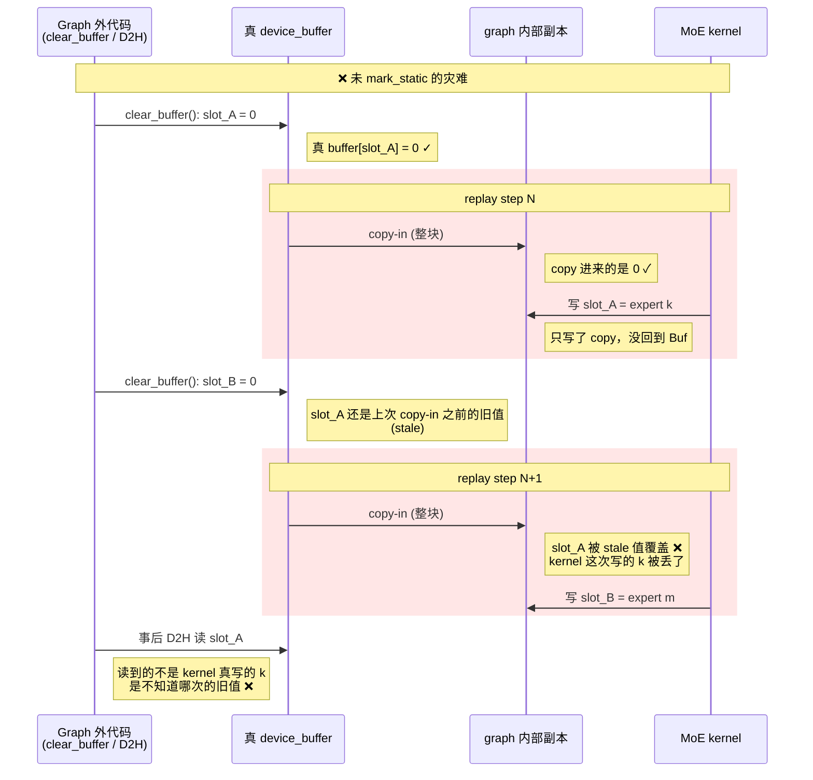

对 device_buffer 来说：
1. **生命周期跨 serving**——像权重一样长，但内容会变
2. **每次 forward 只写当前 batch 的 slot**，其它 slot 必须保留历史
3. **`clear_buffer()` 在 graph 外**——copy-in 不能覆盖它
4. **D2H 读也在 graph 外**——copy-out 没触发就读不到 kernel 真实结果

**三者必须是同一块内存**：graph 内写的 = graph 外读的 = graph 外清的。`mark_static_address` 就是一句话让 torch.compile 满足这一点——"别给我做内存翻译"。

#### (5) 为什么 Tomer 要"试 5 种写法"

因为 mark 的**粒度**和**时机**很微妙：

| 尝试 | 结果 |
|------|------|
| 只 mark 整个 `(L, N, K)` buffer | per-layer view 仍被 compile 当新 tensor → copy |
| mark 每次动态切出来的 `buffer[layer_id]` | view 指针每次调用不一定稳定 → 失败 |
| **持久挂模块属性** `module._routing_replay_out = buffer[layer_id]` + mark | compile 按引用抓属性 + view 指针永远稳定 → ✅ |

这就是 #39917 提交里特别写 `bind_routing_capture_to_model()`、per-layer **持久模块属性** + `cudagraph_mark_tensor_static`（vLLM 对 `torch._dynamo.mark_static_address` 的薄包装）的原因。

#### (6) 最短记忆要点

- Graph 只管"指针 + 操作"，不管"值"。
- torch.compile 默认把外部 tensor **当可能变的指针对待**，在 graph 内复制一份。
- **只有跨 replay 保留状态 + graph 内外都要访问 + 同一块内存** 这三条同时成立时，才需要 `mark_static_address`。
- router replay 的 device_buffer 是完美满足这三条的少数 tensor；模型 forward 里 99% 的 tensor 都不满足。

---

### 3. H.X. 方案（PR #39568）：干掉 SharedMemory，走 ModelRunnerOutput + HTTP 出口

**关键变更**（见 PR 描述和 diff 文件清单）：

1. **去掉 shm / fcntl / 全局单例**：`RoutedExpertsReader` → 新的 **slot-indexed `RoutedExpertsManager`**，用 KV block 对齐的 slot 索引（`block_id * block_size + offset`），让**被 prefix cache 命中的 block 的 router 数据也能保留下来**（和当前版本"prefix hit 位置=0" 不同）。
2. **Non-blocking D2H + pinned memory**：GPU → pinned CPU 用 `non_blocking=True`，在 sync 和 async scheduler 两条路径都能和计算 overlap。
3. **Abort 支持**：在释放 KV block 之前捕获 router，塞进 `EngineCoreOutput`，**被抢占 / 被 abort 的 running request 也能返回 router**（Joel 群里反复确认过的语义）。
4. **HTTP `/inference/v1/generate` 出口**：`GenerateResponseChoice` 加三个字段：`routed_experts`（base64 编码的 numpy）、`routed_experts_shape`、`routed_experts_dtype`。客户端解码：
   ```python
   routed_experts = np.load(io.BytesIO(base64.b64decode(routed_experts)))
   ```
5. **Shape / 生命周期与 full sequence 对齐**：每次都返回 `(prompt + all tokens, num_layers, top_k)`；partial rollout 的"拼接 or 覆盖"策略移交给 RL 框架。
**H.X. #39568 的新数据流（替代老架构）**：

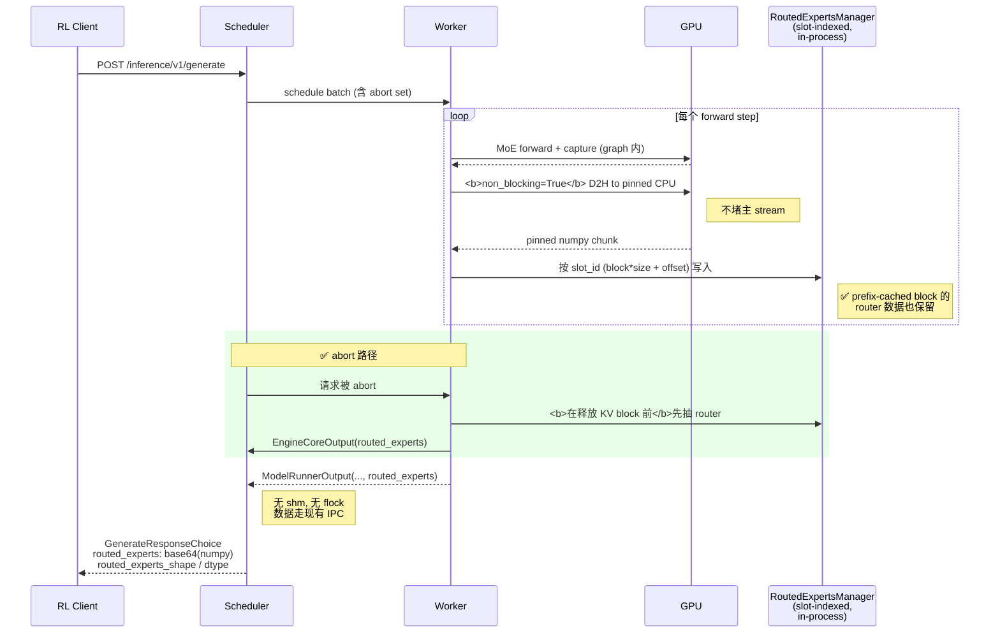

关键改进点（对齐对话里 H.X. 的原话）：

| 对话节选 | PR 实现 |
|----------|---------|
| "把 shm 去掉" | 删 `RoutedExpertsReader` + `_create_or_attach_shared_memory` |
| "/inference/v1/generate http 可以返回" | `serve/disagg/protocol.py` + `serving.py` 加字段 |
| "partial rollout 的 abort 也可以返回" | 在 scheduler 释放 KV block **前**先抽 router |
| "running 请求被 abort 是有返回的，只是请求被抢占后再 abort 就不返回" | 状态机限制 |
| "每次 vllm 都会返回所有 token 的 router" | shape = `(prompt_len + response_len, L, topk)` |

6. **H.X. 内部验证矩阵（版本 18，2026-04-15）**：
   - ✅ Qwen3 dp+ep 跨机
   - ✅ rl 效果 diff / 速度无退化
   - ✅ prefix + cudagraph
   - ✅ MTP + cuda graph + prefix
   - ✅ 跨机 dp+ep、tp16
   - ✅ Qwen3.5 带 linear 的模型（4/15 稍后补测通过）
   - ❌ **开 flashinfer on cuda graph 会挂**（群里最后锁定的红灯）
   - ❌ **PP 不行**（"兼容不过来了"）
   - ⚠️ pd / offload / r3 同时叠加"不知道咋搞"

### 4. NV 方案（PR #39917 / RFC #39701，TomerBN-Nvidia）：device cache + async D2H + flashinfer 贯通

**整体架构图**：

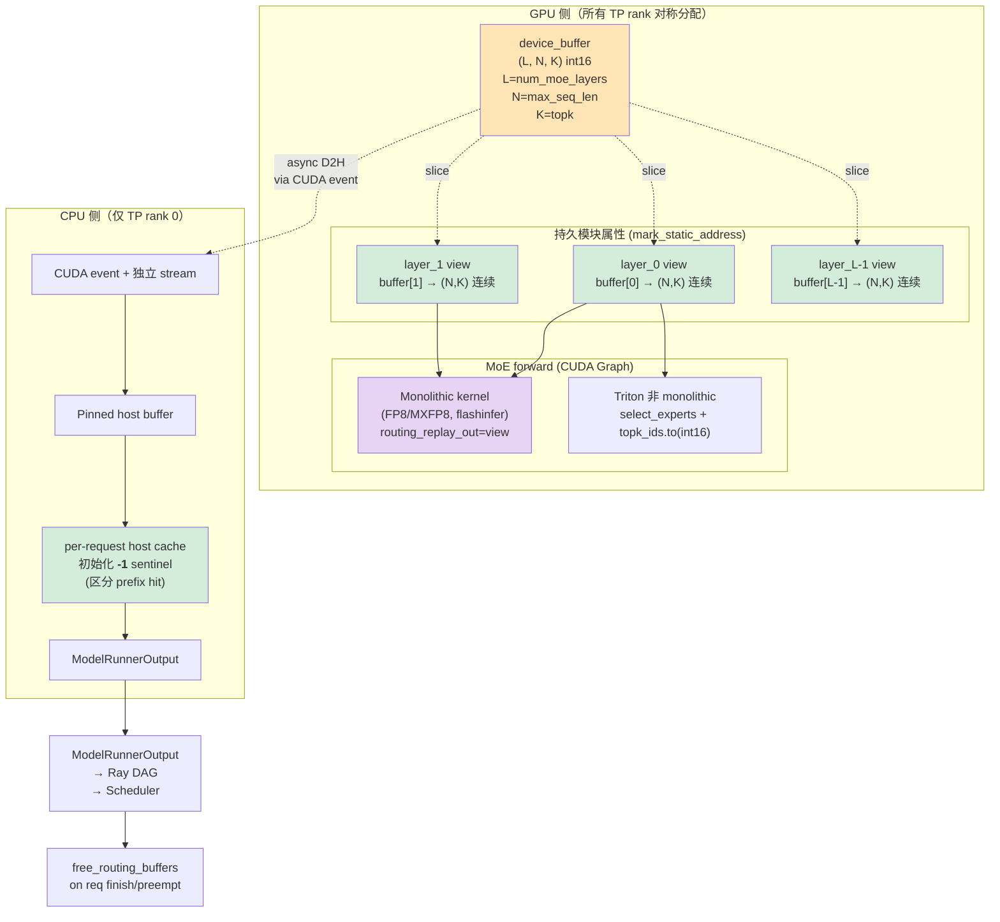

**设计核心**：

1. **预分配 `(L, N, K) int16` device buffer**，`buffer[layer_id]` 给每层做**连续 (N, K) view**。每个 `FusedMoE` 层拿到一个持久模块属性 `module._routing_replay_out = buffer[layer_id]`，`torch.compile` 按引用抓模块属性，于是 CUDA graph replay 永远写到活 buffer。
2. **`cudagraph_mark_tensor_static`** 挂在每个 per-layer view 上，阻止 snapshot/restore 清零。RFC 里 Tomer 说"试了 5 种写法"。
3. **异步 D2H**：CUDA events + pinned memory scatter，只在 TP rank 0 上做拷贝；`moe_layer_id` auto-increment 给 `FusedMoE` 做 buffer binding。
4. **Monolithic kernel 贯通**：依赖 **FlashInfer 的 `routing_replay_out`**（TomerBN-Nvidia 另一个 FlashInfer PR 3024，当时审核中），把参数串到 `apply_monolithic()` 链路里；kernel 直接写 expert ID，不走 Triton 的 `select_experts`。非 monolithic Triton 路径则在 `select_experts()` 之后写 `topk_ids.to(int16)`，用 `_monolithic_writes_routing_replay` flag 区分。
5. **MTP + prefix cache**：host cache 初始化为 **`-1` 哨兵**（区分 prefix hit 和 expert 0）；`output_processor` 按实际 accepted token 做 trim；seqlen 按请求状态里权威 token 数 clamping。
6. **多机**：device buffer 在所有 TP rank 上对称（维持 CUDA graph 对称性），只 rank 0 做 D2H + host cache，数据走 `ModelRunnerOutput` → **Ray DAG** → Scheduler，完全替换 SharedMemory 路径。
7. **API 兼容**：`--enable-return-routed-experts` 不变，响应字段 `routed_experts` 不变，shape `[seq_len, num_moe_layers, top_k]` 不变，仅仅内部管线变。
8. **内存泄露修复**：`_update_states` 里在 request finish/preempt 时 `free_routing_buffers()`，否则 per-request numpy buffer 会无限累积。

**NV 验证矩阵（GB200 GPU，120B BF16 dummy + 400B+ MXFP8 real weights，9 配置全绿）**：

| 配置 | baseline | RR 开启 | overhead |
|------|---------|--------|---------|
| Random ISL=1024/OSL=1024 (400B+ MXFP8) | 4,779 tok/s | 4,685 tok/s | **2.0%** |
| Sonnet ISL=1024/OSL=128 | 2,489 tok/s | 2,353 tok/s | **5.5%** |

- GSM8K pass@1 = **95.77%**，和 baseline 完全一致（4 seed × 1319 题）。
- 单机 TP=4：7,767 tok/s；prefix caching：7,136 tok/s；DP=2（2 节点 × TP=4）：10,170 tok/s。

**为什么布局从 `(N,L,K)` 改成 `(L,N,K)`——一张内存图**：

```
老布局 (N, L, K) int32：
  token 0 的所有层:  [L0_K0 L0_K1 ... L0_Kk | L1_K0 L1_K1 ... | ... | LL_K0 ...]
  token 1 的所有层:  [...]
  
  问题: 取"第 i 层的全部 token"得做 strided read，不连续。
        flashinfer routing_replay_out 要的是"第 i 层连续 (N,K)"。
        → 每层要额外 copy 一次才能传给 kernel。

新布局 (L, N, K) int16：
  Layer 0:  [tok0_K0 ... tok0_Kk | tok1_K0 ... | ... | tokN_K0 ...]   ← 连续
  Layer 1:  [...]                                                      ← 连续
  ...
  
  优势: buffer[layer_id] = (N, K) 连续 view，零拷贝传给 flashinfer。
        int16 节省一半内存，topk_ids < 32768 够用。
```

**与 H.X. 方案的层次分工**（群里俊杰的一句话精炼）：
> "我看了下两个 pr，我感觉 nv 那个还是再优化 capture 那边的，frontend 这块还是 H.X. 设计的好"

可视化：

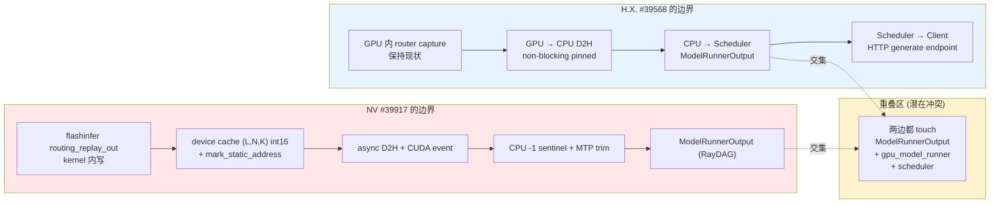

### 5. verl 消费侧：PR #4101（R2/R3 支持）与 PR #6029（partial rollout bug）

**#4101（litianjian 提、ISEEKAN 合并）**：
- verl 侧落地 R2（Megatron 训练侧 record/replay）和 R3（vLLM rollout record + 训练 replay）。
- R2 当前 patch Megatron（等 `NVIDIA/Megatron-LM#2101` 合并后撤 patch），覆盖 DP/TP/EP/ETP/PP/recompute。
- R3 vLLM rollout 已通、SGLang rollout TODO。
- **关键逻辑**（见 `verl/experimental/agent_loop/agent_loop.py` diff）：rollout 返回的 `routed_experts` shape = `(length, layer_num, topk_num)`，目标张量 `(1, total_length, layer_num, topk_num)`，按 left padding 对齐放到 `start_pos:end_pos`；缺失位（比如 generated 最后一个没 forward 的 token）给 0 且不参与 loss。

**#6029（fully_async bug）**：
- **症状**：`actor/ppo_kl` 在 partial rollout 恢复后出现尖峰。
- **根因**：SGLang（和 vLLM 也一样）在 partial rollout 抢占重跑时返回的是**完整 sequence（prompt + 全部 token）**的 router，不是 delta。老代码用 `torch.cat` 连接，结果变成 `prompt+A+B+C + prompt+A+B+C+D+E`，router 被重复、和 token 错位。
- **修复**：一行改 cat → replace。
- **为什么群里 Joel 反复问 H.X.**：因为 vllm 的语义就是"每次返回全量"，这个事实决定了**partial rollout 的历史版本拼接策略必须在 RL 框架里做**（groupwise 版本号拼接 or 直接 replace），vLLM 不承担这层语义。SGLang、SLIME 当前都用**最新权重生成的 router**。

**Partial rollout 语义图（踩 bug 的时刻）**：

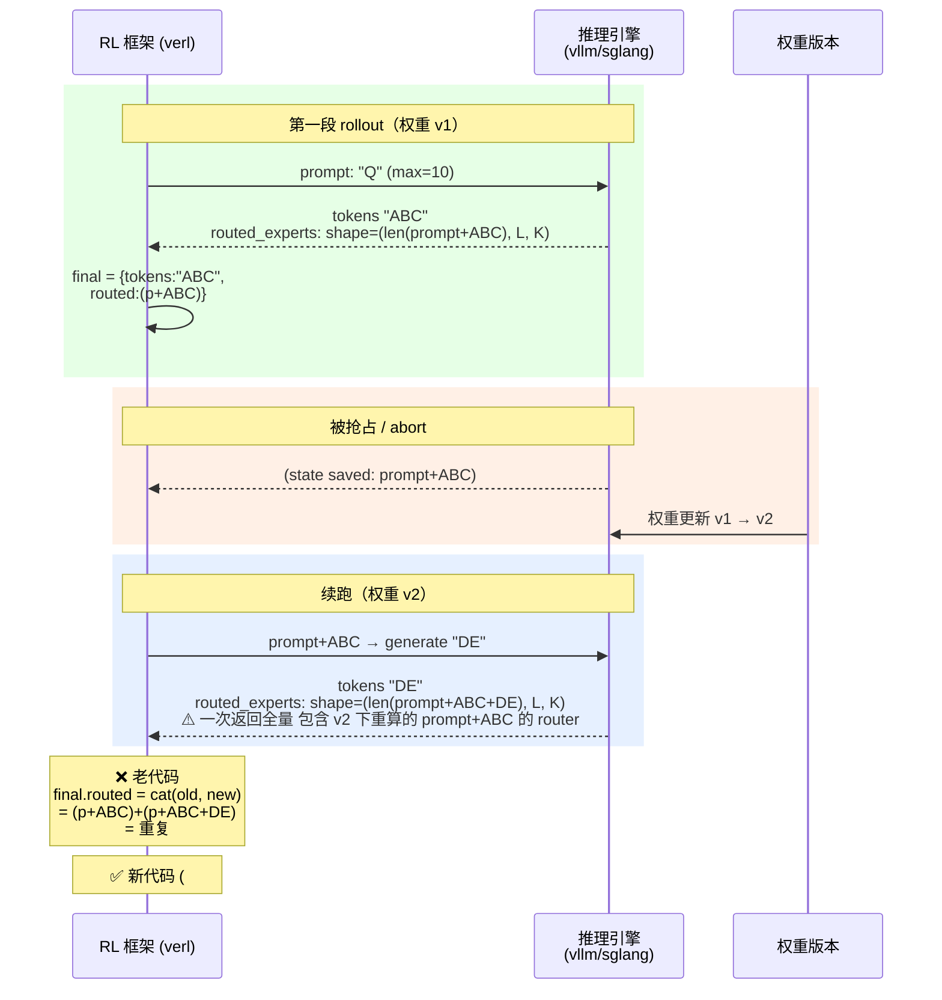

这张图也揭示了一个更深的问题：**"续跑里的 prompt+ABC 用 v2 还是 v1 的 router？"**——目前所有开源实现（vllm/sglang/SLIME）都选 **v2 的最新 router**；Joel 群里确认"那 partial rollout 我们先用最新的 router_experts 吧"，未来可能换成每段用各自权重的 router 拼接，但需要实验。

## 技术洞察 / Technical Insights

1. **capture 与 fetch 必须解耦**（申奥的 core 观点）：当前"每次从 scheduler 的 shm 里取 + 挂 OAI-compatible 响应返回"把两个 concern 绑死了。理想做法：
   - capture 永远跑（轻量，graph 内），数据持久化到**和 KV cache 一致生命周期**的 scheduler 内部对象；
   - fetch 走**单独的 endpoint**（`GET /routed_experts/{req_id}` 之类），什么时候要什么时候取；
   - RL 框架自己决定从 scaffold 还是 OAI 路径取。

   但 H.X. 的反驳："**怎么保证你再次调用的时候他还在那里**"——KV cache 是会被驱逐的，sentinel 值能帮忙但不解决根本问题。

2. **per-request opt-in**（junjzhang #38079 RFC 的设计核心）：`enable_return_routed_experts` 只初始化 capturer；真正要不要抽数据由 `vllm_xargs={"return_routed_experts": true}` per request 决定。这让"99.9% 的 forward step 零额外工作"成为可能。#39917 在这点上没写明（API flag 保持兼容），但按 junjzhang 的分析这是解决 DP+EP hang 的最本质路径。

3. **PP 不兼容不是偶然**：因为 routed_experts 必须汇总到 rank 0 做 D2H，PP 下不同 stage 的 MoE 层分布在不同机器，把分散数据聚到一张图里后做 graph-safe 的异步拷贝，本质就是一次额外的 collective。H.X. 放弃 PP 是务实选择，但对需要 PP 的 400B+ 模型是个 gap。

4. **"神之方案"——和 mooncake / KV cache 生命周期绑定**：玩笑是玩笑，但方向有道理——既然 router 数据本质上是"per-token side data"，让它走 mooncake store 的 put/get/lookup 三件套、和 KV block 一起管理（一起 evict、一起 lookup），可以天然解决：
   - 多机（mooncake 本来就跨机）
   - 生命周期（跟 KV block）
   - PP（mooncake 不关心 PP 结构）

   但代价是：每个 put/get 都要打 mooncake，增加一条关键路径依赖，对 RL rollout 的 QPS 影响未知。申奥在群里自认这个方向可行，说 "GPU Worker Process 那一层去和 mooncake 进行交互"。

5. **FlashInfer 是 NV 方案的隐性依赖**：`routing_replay_out` 在 FlashInfer 主仓还没合的时候，vLLM #39917 是不能开 monolithic path 的；这也解释了 H.X. 的矩阵里**唯独 flashinfer on cuda graph 是红灯**——两套方案都绕不开这个 upstream 依赖。

6. **int16 vs int32 的真实收益**：128 experts 的模型 `topk_ids < 128`，int8 甚至够用，int16 是为兼容未来 256–1024 experts 留的 headroom。600B+ / 2708 prompt × 36 layer × 4 topk 的量级下，int32 → int16 每 prompt 省 **~1.5 MB**，对 ModelRunnerOutput IPC 的 shm ring buffer 是实打实的减压。

## 决策与理由 / Decisions and Rationale

| 决策 | 理由 | Owner | 状态 |
|------|------|-------|------|
| vLLM 每次返回**全量 token** 的 router | 减少框架负担、让拼接策略上移到 RL 框架 | H.X. / Joel | 已定（#39568 实现） |
| partial rollout 的 router 暂时用**最新权重版本** | SGLang/SLIME 现有实现都是这样，先对齐再 ablate | Joel / H.X. | 已定（verl #4101 默认） |
| vLLM 接受 re-prefill 消耗，不承诺"router 一直在那" | 和 KV cache 生命周期一致，简化实现 | H.X. | 已定 |
| 申奥去主动联系 NV，对齐 #39917 与 #39568 | 避免两条 PR 互相冲突，理想合并成一个 | 申奥 | 进行中（"我现在就问"） |
| Joel 下周比赛打完先跑 H.X. 的 draft PR 做 RL e2e 验证 | H.X. 内部只做了小规模，没在开源 main 上 rebase 跑过 | Joel | 待办 |
| R3 + partial rollout 在 verl 侧用 replace 不用 cat | 一次返回全量的事实 | NoonePauseferg | 已合（verl #6029） |
| flashinfer + cuda graph 暂不支持 | 依赖 FlashInfer 上游 `routing_replay_out` 合入 | NV / H.X. | 阻塞于 flashinfer-ai/flashinfer#3024 |
| PP 不支持、pd+offload+r3 组合不 commit | 工程复杂度太大，先保主流配置 | H.X. | 已定 |

## 争议与讨论 / Debates and Disagreements

### 三套方案的能力矩阵（一图看全）

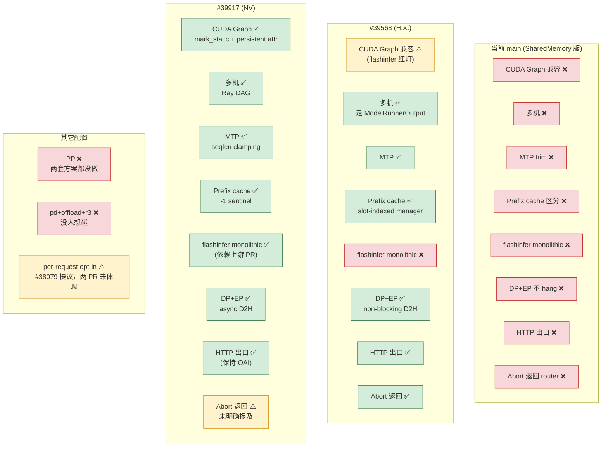

### 争议 1：capture 与 fetch 是否要解耦、fetch 是否要单独端点

- **申奥**："提供一个端点解耦 capture 和 fetch ……要的时候就从 scheduler 中拿出来，不要跟着 OAI-compatible 请求返回。"
- **H.X.**："他不是永久保留的……怎么保证你再次调用的时候他还在那里？"（意指 KV block 可能已被 evict）
- **申奥折中**："可以加 sentinel 值 / 我可以接受 re-prefill"；RL 框架层可以处理 miss。
- **H.X. 最终立场**："感觉适合公司内部定制。因为是开源，要不然就得连着 verl 一起改……只能支持常用的了，兼容不过来了"。
- **申奥的"神之方案"**："就是拷打 mooncake，和 KV 绑定在一起"。
- **H.X. 补一刀**："如果 pd、offload 还要 r3，真不知道咋搞了……这鬼东西跟狗屎一样，牵扯太多。"

**未解**：开源版本短期走"挂 OAI 响应"的 H.X. 方案，endpoint 解耦 / mooncake 绑定作为下一阶段演进。

**capture/fetch 耦合 vs 解耦的对比图**：

```mermaid
flowchart LR
    subgraph Now["当前 + H.X. 方案：耦合 (挂响应)"]
        direction TB
        NR[Request] --> NC[capture]
        NC --> NS[存 ModelRunnerOutput]
        NS --> NO[OAI response<br/>routed_experts inline]
        NO --> ND[Client]
    end

    subgraph Prop["申奥提议：解耦"]
        direction TB
        PR[Request] --> PC[capture<br/>graph 内]
        PC --> PS[存 scheduler 内部对象<br/>(寿命 = KV cache)]

        PS --> PO1[OAI response<br/>不带 router]
        PO1 --> PD1[Client 拿 token]

        PS -.独立 endpoint.-> PF[GET /routed_experts/req_id]
        PF --> PR2[RL 框架按需拉]
    end

    subgraph God["神之方案：mooncake 绑定"]
        direction TB
        GR[Request] --> GC[capture]
        GC --> GM[put 到 mooncake<br/>和 KV block 同 key]
        GM --> GL[mooncake lookup/get<br/>跨机 by design]
        GL --> GT[训练 / eviction 自动]
    end

    style Now fill:#FFE7E7
    style Prop fill:#FFF3CD
    style God fill:#E7F3FF
```

- **Now（左）**：实现简单、易用性好，但每次请求都要完整带 router payload（可能 MB 级），对高 QPS 场景不友好。
- **Prop（中）**：易用性打折（client 要额外调一次），但能支持"scaffold 不处理 router"的场景；问题是 KV block 会被 evict，需要 `-1` sentinel / re-prefill 兜底。
- **God（右）**：天然多机 / PP / 生命周期正确，但每 put/get 都是关键路径网络调用，QPS 影响未知；且引入 mooncake 强依赖。

### 争议 2：MTP 是否需要 router replay

- **H.X.**："mtp 还要 router replay?"（隐含质疑）
- **Joel**：未直接回答，后面 H.X. 自己实测"mtp + cuda graph + prefix 目前都是没问题的"，等于 **自洽收敛到"支持"**。
- **注**：MTP 推测解码时，rejected 位置的 router 需要按 accepted token trim，这是 #39917 明确列入 scope 的 issue 4。

### 争议 3：partial rollout abort 的 router 是否返回

- **Joel (from Joel/H.X. 私聊截图)**："目前 abort 也会返回全量的 router_experts 吧？"
- **H.X.**："这样说也不对，确认下应该是，running 请求被 abort 是有返回的，只是请求被抢占后再 abort 就不返回 router"——精确到 running vs preempted 的状态。
- **Joel**："ok，那 partial rollout 我们先用最新的 router_experts 吧"。
- **H.X. #39568 实现**：capture routed experts **before** freeing KV-cache blocks on abort，塞进 `EngineCoreOutput`。

## 验证结果 / Verification Results

| 来自对话的声明 | 来源 / 证据 | 状态 | 备注 |
|---------------|------------|------|------|
| 当前 vLLM 用 shm + fcntl + capture 回调 | `routed_experts_capturer.py:14,29,47-77` | ✅ 确认 | 和 H.X./NV RFC 描述吻合 |
| DP+EP 开启后 20–60s hang | RFC #38079 全文 | ✅ 确认 | junjzhang 有实验表 |
| 跨机 shm 不可达 | `shared_memory.SharedMemory` 节点本地语义 | ✅ 确认 | NV RFC #39701 明确列为 issue 3 |
| #39568 去掉 shm，走 ModelRunnerOutput，加 HTTP 出口 | PR 描述 + file list（`serve/disagg/protocol.py` etc.）| ✅ 确认 | |
| #39917 的 device cache 是 `(L,N,K) int16` | RFC #39701 设计章节、commit 描述 | ✅ 确认 | |
| #39917 依赖 FlashInfer `routing_replay_out` 合入 | RFC 明确列出依赖 `flashinfer-ai/flashinfer#3024` | ✅ 确认 | |
| NV 在 GB200 实测 2% overhead、GSM8K 95.77% | RFC #39701 validation 章节 | ✅ 确认 | 只能当 NV self-report，vLLM CI 未跑 |
| vLLM 每次返回全量 token 的 router | verl #6029 PR 描述 + SGLang 源码引用（`io_struct.py:1020`）| ✅ 确认 | verl 方一手资料 |
| SGLang/SLIME 用最新权重版本的 router | H.X. 陈述，未找到 SLIME 源码直接引文 | ⚠️ 未独立验证 | 需要到 SLIME 仓验证 |
| Qwen3 dp+ep 跨机、prefix、MTP 组合已通 | H.X. 4/15 15:38 消息 | ⚠️ 单方面声明 | 小规模内部验证，主 main rebase 还没跑 |
| flashinfer + cuda graph 会挂 | H.X. 多次确认 | ⚠️ 单方面声明 | 无 repro，可能和 flashinfer 版本有关 |
| verl #4101 已合入，R2/R3 with Megatron | PR 状态 MERGED | ✅ 确认 | |

## 常见疑问 FAQ / Deep Dive

### Q1: 什么是 Monolithic kernel，为什么 capture 不到？

**Monolithic kernel**：一个 kernel 把 `router topk + expert grouped matmul` 全部融进去的 fused kernel。典型代表是 FlashInfer 的 `trtllm_fp8_block_scale_routed_moe` / MXFP8 / FP4 系列——**量化 MoE 模型的默认路径**。

**源码差异**（`vllm/model_executor/layers/fused_moe/runner/default_moe_runner.py:491-509`）：

```python
if self.quant_method.is_monolithic:
    result = self.quant_method.apply_monolithic(
        layer=layer, x=hidden_states,
        router_logits=router_logits,       # ← 只传 logits，没 topk_ids
    )
else:
    topk_weights, topk_ids = self.router.select_experts(...)  # ← Python 层先算 topk
    result = self.quant_method.apply(..., topk_ids=topk_ids)  # ← Python 有 topk_ids 这个 tensor
```

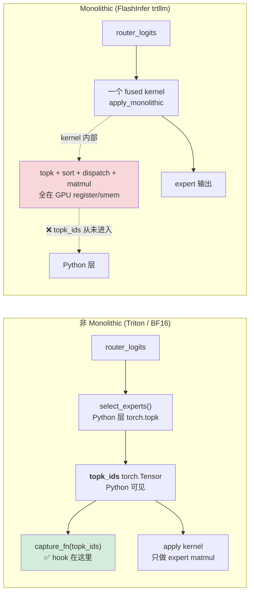

**不能被 capture 的根因**：`capture_fn` 挂在 `base_router.py:281`，发动时机是 Python 拿到 `topk_ids` tensor 之后。Monolithic 路径下 `select_experts()` 根本没被调用，`topk_ids` 只在 kernel 的 register/smem 里存在 ns 级就被消费——Python 永远看不到，hook 无从挂起。

**NV #39917 的解法**：改 FlashInfer kernel 签名，加 `routing_replay_out` 可选参数，传 device_buffer 第 L 层 view 的指针；kernel 在算完 topk 的瞬间**顺手写一份到这块内存**。等于把 hook 推进 kernel 内部。None 时完全跳过这行写入，零开销。

**H.X. #39568 为什么没解决**：H.X. 只动 IPC/前端，不改 kernel。所以 FP8/MXFP8 模型（默认走 monolithic）**用 H.X. 的 PR 仍然捕不到 router**——这就是群里 H.X. 说"开 flashinfer 会有问题"、俊杰评价"nv 那个应该是解决 flashinfer 的问题"的背景，两个 PR 天然互补。

---

### Q2: MTP 训练时权重常被冻结，为什么还要记录 router？

**关键澄清**：RFC 的"MTP handling"不是在讨论"要不要记录 MTP 层的 router"，而是在解决 **capture 长度 ≠ 最终 accepted token 长度** 的对齐问题。

MTP (Multi-Token Prediction) 是推测解码：一次 forward 处理 K 个 token 位置（1 当前 + K-1 推测），最后 verify 只接受 M ≤ K 个。

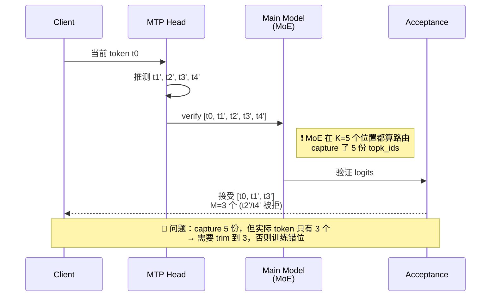

**谁的 router 需要 replay**：

| 路径 | 算 router 的模块 | 训练时是否 replay |
|------|----------------|------------------|
| Main model MoE 算到推测位 t1'~t4' | Main model | ✅ 必须（accepted 的 M 个位置必须一致） |
| MTP head 自身的 MoE | MTP head | 看训练设置；vLLM capturer 统一都 capture，分不清哪层是 MTP 哪层是 main |

**#39917 的修复就是 trim**（从 PR diff 摘出来）：

```python
num_gen = self.detokenizer.num_output_tokens()   # 实际 accepted 的 gen token 数
if gen_routed_experts.shape[0] > num_gen and num_gen > 0:
    gen_routed_experts = gen_routed_experts[:num_gen]   # 截掉 rejected 位置
```

**重点**：
- capture 多了是**无法避免的**——forward 必须跑完 K 个位置才能判断接受几个
- trim 是**事后对齐**——请求结束知道 accepted 数后，把 routing 截到正确长度
- **和"MTP 权重是否更新"无关**。即使 MTP head 完全冻结，main model 的 MoE routing 依然要精确匹配 accepted 序列，不然 `routed_experts[i]` 和 `tokens[i]` 对不上，训练 loss 直接爆
- 当前上游实现就是**没做 trim**——一个 MTP=5、decode 10 个 token 的请求，capture 出来是 `(prompt + 10*5, L, K)`，但 client 拿到的只有 `prompt + 10` 个 token，训练侧按 token 长度索引 router 直接错位

---

### Q3: "prefix cache hit 位置 fill(0) 但 expert 0 也合法"的含义

**代码证据**（`routed_experts_capturer.py:154`）：

```python
self._host_buffer_view = np.ndarray(shape, dtype=np.int32, buffer=self._shm.buf)
self._host_buffer_view.fill(0)   # ← 初始化全 0
```

**场景**：vLLM 的 prefix caching 会让"两个请求 prompt 前 N 个 token 相同"时**跳过 forward**，直接复用 KV block。跳过 forward = router 不跑 = `capture_fn` 不触发 = buffer 里对应位置**保持初始值 0**。

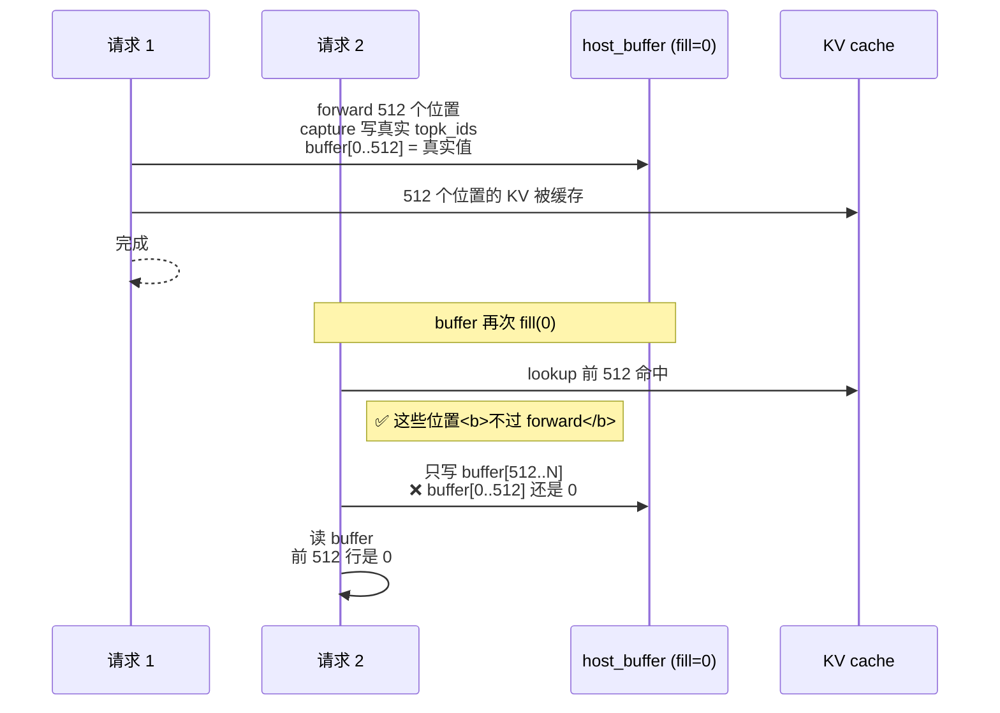

**为什么是 bug**：expert ID 合法范围 `[0, num_experts-1]`，**0 是完全合法的 expert**。前 512 行的 `0` 有两种含义：
- A: "此位置没被 capture（prefix hit）"
- B: "此位置真的路由到 expert 0"

**数值上一模一样，分不出来**。训练侧会：
1. 按 "这 512 个位置全走 expert 0" replay forward → 梯度完全错，loss 漂
2. 或误以为数据有效，把"假 0"当真实 routing 往 expert 0 的梯度里灌

**两个方案的修复思路不同**：

```mermaid
flowchart LR
    subgraph NV["NV #39917：-1 sentinel"]
        N1[host buffer<br/>fill(-1)] --> N2[只写当前 forward 的位置]
        N2 --> N3[prefix hit 位置 = -1<br/>训练侧自己兜底]
        N3 --> N4[方案：skip loss / re-prefill / ...]
    end

    subgraph HX["H.X. #39568：slot-indexed"]
        H1["host buffer 按<br/>block_id * block_size + offset 索引"] --> H2[写时用请求1的 slot_id]
        H2 --> H3[请求2 查同 block<br/>→ 读到请求1写入的真实 routing]
        H3 --> H4[✅ prefix 位置自然有数据]
    end

    style N3 fill:#FFF3CD
    style H4 fill:#D4EDDA
```

- **NV 方案**：承认"prefix hit 我没数据"，用 `-1`（expert id 永远 ≥ 0，所以 -1 是不可能的真实值）当哨兵，由 RL 框架决定怎么处理
- **H.X. 方案**：让 routing data 跟 KV block **生命周期绑定**——存 routing 用和 KV 一样的 slot 索引，prefix 命中 KV block 时 routing 天然一起命中，**零丢失**

H.X. 方案更优雅但更复杂（要管 routing 的 eviction 和 KV 一致）；NV 方案简单但训练侧多一层兜底。两个方案解决同一个问题的哲学不同。

---

## 术语表 / Glossary

| 术语 | 含义 | 场景 |
|------|------|------|
| Router Replay (R2/R3) | MoE RL 里把 rollout/log-prob 阶段的 expert 选择记录下来、训练时重放，保证 on-policy 一致性 | verl #4101 的 R2/R3 两种模式 |
| routed_experts | 每个 token 每层选中的 topk expert ID，shape `(seq, layers, topk)` | vLLM 输出字段 |
| capture() 回调 | MoE 层里 router 选完 topk 之后调的一个 hook，把 topk_ids 写入捕获 buffer | 当前 vLLM / SGLang 老实现 |
| SharedMemory (shm) | Python `multiprocessing.shared_memory`，节点本地，跨进程 | 老实现 IPC 方式 |
| fcntl.flock | 文件锁，跨进程互斥 | 老实现同步 |
| ModelRunnerOutput | vLLM V1 Worker → EngineCore 的标准 IPC 数据结构 | #39568/#39917 都选这条路 |
| cudagraph_mark_tensor_static | vLLM 的接口，让 CUDA graph capture/replay 不 snapshot/restore 这个张量 | #39917 的核心技巧 |
| monolithic kernel (apply_monolithic) | FlashInfer 融合了 routing + expert compute 的 fused kernel，FP8/MXFP8 的默认路径 | #39917 专门贯通它 |
| routing_replay_out | FlashInfer kernel 新增的 optional 参数，kernel 内直接写 expert ID | flashinfer-ai/flashinfer#3024 |
| MTP (Multi-Token Prediction) | 推测解码变体，一次 forward 预测多个 token，有 reject/accept | 需要 trim router 到 accepted tokens |
| Prefix caching | KV block 共享给多个请求；命中位置本轮不 forward | 需要 `-1` sentinel 区分 "hit" 和 "expert 0" |
| partial rollout | RL 训练中因为版本更新等原因中途 abort 一条 trajectory，之后用新权重接着生成 | verl #4101/#6029 主战场 |
| DP+EP | Data Parallel + Expert Parallel，MoE 大模型常用组合 | DP rank 之间通过 EP all-to-all 耦合，这就是 DP+EP hang 的来源 |
| scaffold | 申奥所在组维护的 RL 框架（群里没展开） | 申奥强调"我想 scaffold 不处理这个"——即 scaffold 希望 RL 框架层不碰 router 的细节 |

## 待深入 / Open Questions and Further Study

**合并路线图（申奥任务）**：

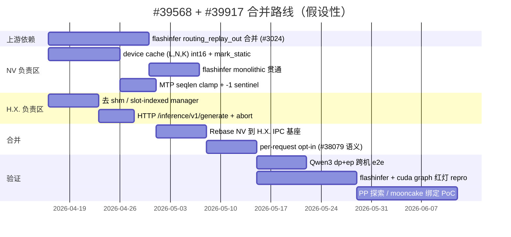

1. **#39568 和 #39917 的合并策略**：两边 PR 都 touch `routed_experts_capturer.py` / `gpu_model_runner.py` / `scheduler.py`，冲突面巨大。申奥说"我再了解一下上下文然后我去和 nv 那边约个会"——需要输出一份合并提案（谁负责 IPC 链路、谁负责 capture kernel、接口边界在哪）。
2. **per-request opt-in 是否落地**：junjzhang RFC #38079 提议的 `vllm_xargs={"return_routed_experts": true}` per-request 开关，在 #39568 和 #39917 的当前描述里都没明确体现。如果不做这个，即使 IPC 链路换了，"全量开启"下 DP+EP 依旧会有 D2H 压力。
3. **flashinfer + cuda graph 的红灯**：究竟是 `cudagraph_mark_tensor_static` 没覆盖到 flashinfer 内部写入的 tensor，还是 `routing_replay_out` 在 flashinfer 里被当作输入参数 replay 时指针失效，需要具体 repro。
4. **PP 路径**：如果后续 >400B 模型必须 PP，需要设计一次 stage 间 collective 把 per-layer routed_experts 汇到 rank 0。
5. **mooncake 绑定的"神之方案"**：群里玩笑收尾，但值得在 `sprint_dist_kv_results/` 里起一个 design 调研（`mooncake put/get/lookup` vs `ModelRunnerOutput` 的延迟、QPS、eviction 语义、和 KV block 的命名空间）。
6. **pd + offload + r3 三叉组合**：H.X. 放弃，但 scaffold 如果要支持全场景 RL，得有人拍板（可能需要走 "神之方案"）。
7. **SLIME / SGLang 的 router 拼接策略**：H.X. 说"slime 的 router multi turn 是恩拼接的"——具体"恩拼接"是什么逻辑需要到 SLIME 代码里 grep 确认。

## 行动项 / Action Items

| 项 | Owner | 状态 |
|----|------|------|
| 了解上下文，和 NV 对齐合并 #39568 / #39917 | 申奥 | 进行中 |
| 跑 H.X. #39568 的 RL e2e，在 vllm main rebase 后做大规模验证 | Joel（何不凡） | 比赛后开展 |
| flashinfer `routing_replay_out` 上游合并 | TomerBN-Nvidia / flashinfer 团队 | 审核中（flashinfer-ai/flashinfer#3024） |
| 设计"端点解耦 + KV 生命周期绑定 + 可能的 mooncake 路径"的下一阶段 RFC | 申奥（潜在） | 未启动 |
| verl 侧 SGLang rollout 接入 R3 | verl 社区 | #4101 TODO 列表 |

## Suggested Follow-up Experts

- RL 工作流 / rollout 语义问题 → `rl-workflow-expert`（`vllm-infra-skills/.claude/agents/rl-workflow-expert.md`）
- MoE engine / EP 行为 → `moe-engine-expert`（`.claude/agents/moe-engine-expert.md`）
- CUDA Graph 持久 tensor + mark_static 细节 → `knowledge/serving/cuda-graph-patterns.md`
- IPC / ModelRunnerOutput / Ray DAG 跨机 → `serving-systems-expert`
- 端点解耦 + mooncake 绑定方案 → 本仓 `sprint_dist_kv_results/` 与 Mooncake 子项目
