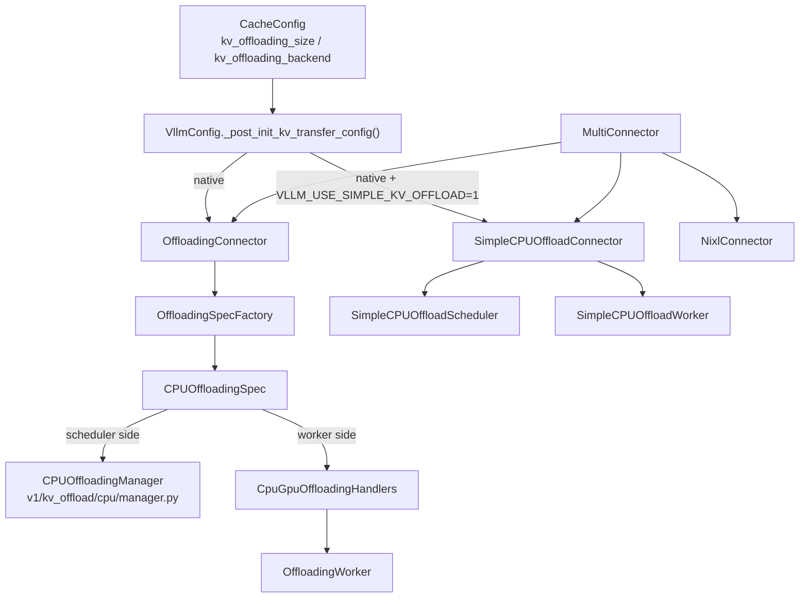
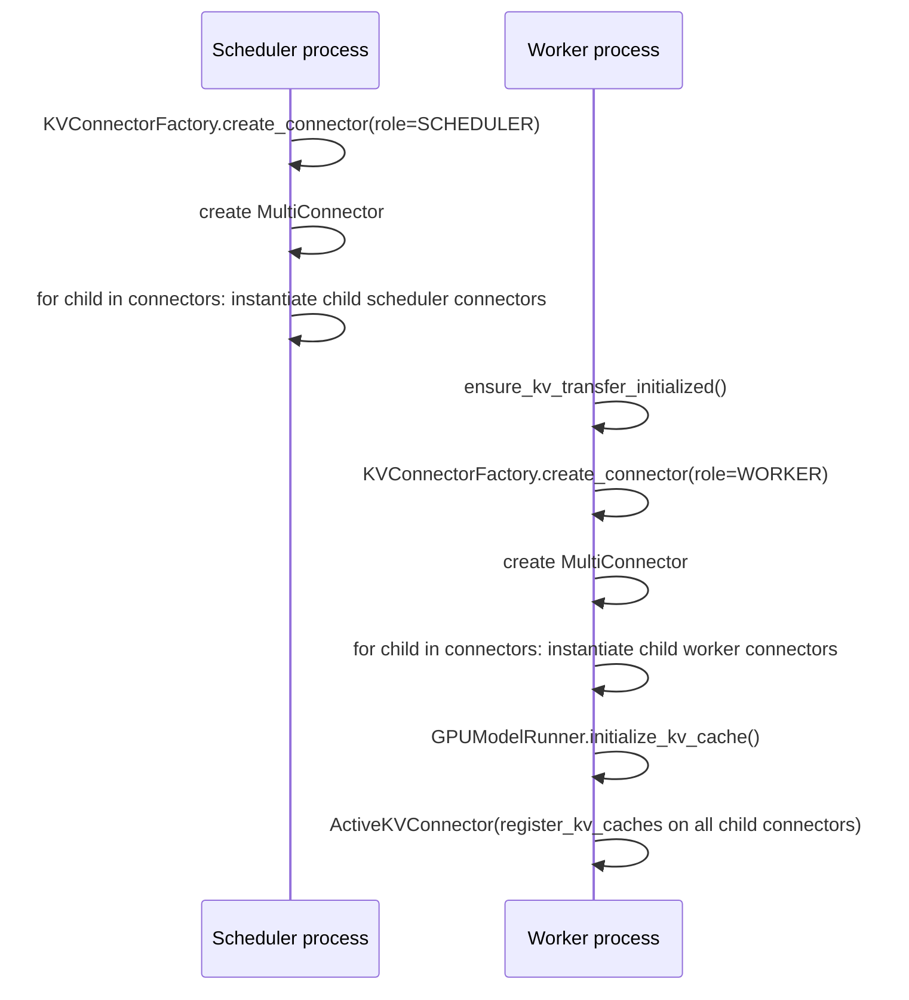
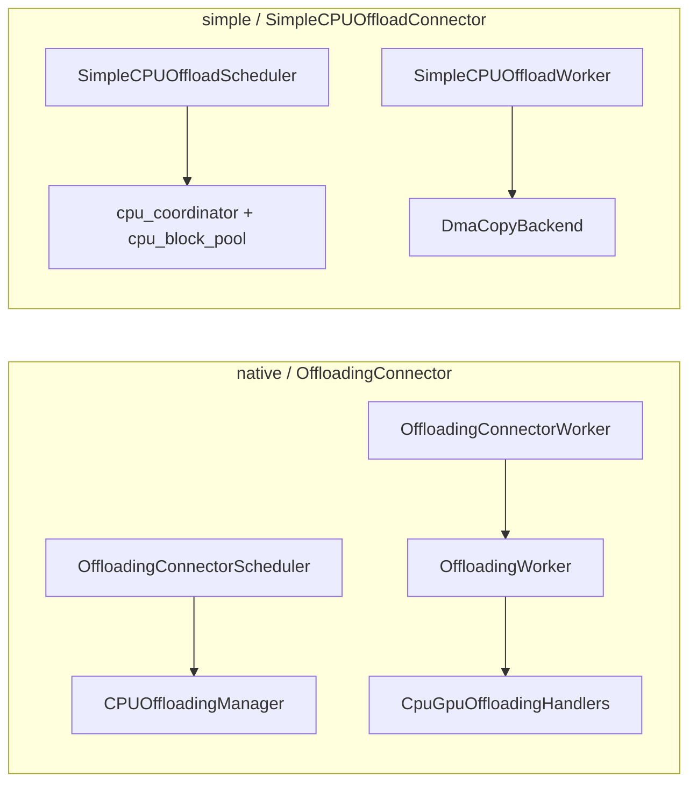

# Source Walkthrough for PD / Native / Simple / MultiConnector

更新时间：2026-04-11

本文聚焦回答四个问题：

1. `native offload`、`simple offload`、`MultiConnector` 在 vLLM v1 里分别是什么。
2. `/vllm/v1/kv_offload/cpu/manager.py` 和这些 connector 的关系是什么。
3. `MultiConnector` 在 P/D disaggregation 场景下是怎么初始化、怎么分发请求的。
4. `simple` 的 `lazy_offload` 是怎么工作的，是否每个 step 都会扫。

本文只覆盖 vLLM v1 的 KV connector 路径，不展开 v0、LMCache、Mooncake、MoRIIO 等其他实现。

---

## TL;DR

- `native offload` 对应的是 `OffloadingConnector`。
- `simple offload` 对应的是 `SimpleCPUOffloadConnector`。
- 两者不是 alias，也不是同一套实现换了个名字。
- `/vllm/v1/kv_offload/cpu/manager.py` 里的 `CPUOffloadingManager` 只服务于 `OffloadingConnector`，不服务于 `SimpleCPUOffloadConnector`。
- `MultiConnector` 的核心规则是：
  - `load` 只选第一个“声称有命中”的 child connector。
  - `save` 会 fan-out 到所有 child connectors。
- 在 `MultiConnector([NixlConnector, OffloadingConnector])` 这种配置里：
  - `OffloadingConnector` 一定会被初始化。
  - `OffloadingConnector` 一定会参与 store/save。
  - `load` 是否落到 offload connector，要看 `NixlConnector` 是否已经先命中。
- `SimpleCPUOffloadConnector` 的 `lazy_offload` 是一个“每 step 增量扫描 GPU free queue 前沿”的策略。
  - 每个 step 都会做 store planning。
  - 但不是每个 step 从头全量扫完整条 free queue。

---

## 0. 关键文件索引

如果只想快速二次追源码，优先看这些文件：

- 顶层配置映射
  - `vllm/config/cache.py`
  - `vllm/config/vllm.py`
- connector 工厂与注册
  - `vllm/distributed/kv_transfer/kv_connector/factory.py`
  - `vllm/distributed/kv_transfer/kv_transfer_state.py`
- `MultiConnector`
  - `vllm/distributed/kv_transfer/kv_connector/v1/multi_connector.py`
- native offload
  - `vllm/distributed/kv_transfer/kv_connector/v1/offloading_connector.py`
  - `vllm/distributed/kv_transfer/kv_connector/v1/offloading/scheduler.py`
  - `vllm/distributed/kv_transfer/kv_connector/v1/offloading/worker.py`
  - `vllm/v1/kv_offload/factory.py`
  - `vllm/v1/kv_offload/cpu/spec.py`
  - `vllm/v1/kv_offload/cpu/manager.py`
  - `vllm/v1/kv_offload/worker/cpu_gpu.py`
- simple offload
  - `vllm/distributed/kv_transfer/kv_connector/v1/simple_cpu_offload_connector.py`
  - `vllm/v1/simple_kv_offload/manager.py`
  - `vllm/v1/simple_kv_offload/worker.py`
- scheduler / worker 接入点
  - `vllm/v1/core/sched/scheduler.py`
  - `vllm/v1/worker/gpu/kv_connector.py`
  - `vllm/v1/worker/gpu/model_runner.py`
- GPU free queue / BlockPool
  - `vllm/v1/core/block_pool.py`
  - `vllm/v1/core/kv_cache_utils.py`

---

## 1. 配置入口与默认行为

### 1.1 非 P/D 分离场景

如果你用的是顶层 cache 配置：

```bash
vllm serve <model> \
  --kv-offloading-size 80 \
  --kv-offloading-backend native
```

那么默认会走 `native` 路径。

对应源码逻辑：

- `CacheConfig.kv_offloading_backend` 默认是 `"native"`。
- 只有 `kv_offloading_size` 被设置时，offload 才真正启用。
- `VllmConfig._post_init_kv_transfer_config()` 会把这套 cache 配置翻译成 `kv_transfer_config.kv_connector`。

简化后的映射规则是：

```python
if kv_offloading_size is None:
    offload_disabled()
elif kv_offloading_backend == "native":
    if VLLM_USE_SIMPLE_KV_OFFLOAD:
        kv_connector = "SimpleCPUOffloadConnector"
    else:
        kv_connector = "OffloadingConnector"
elif kv_offloading_backend == "lmcache":
    kv_connector = "LMCacheConnectorV1"
```

所以：

- 默认 native = `OffloadingConnector`
- `native + VLLM_USE_SIMPLE_KV_OFFLOAD=1` = `SimpleCPUOffloadConnector`

### 1.2 P/D 分离场景

如果你已经手写了 `--kv-transfer-config`，尤其是：

```json
{
  "kv_connector": "MultiConnector",
  "kv_role": "kv_both",
  "kv_connector_extra_config": {
    "connectors": [...]
  }
}
```

那么你应该把想用的 child connector 直接写进 `connectors` 列表里，而不是再依赖“默认 native 映射”。

原因是：

- `--kv-transfer-config` 直接决定顶层 connector。
- `KVConnectorFactory.create_connector()` 会按 `kv_transfer_config.kv_connector` 实例化 connector。
- `MultiConnector` 会继续实例化它的 child connectors。

对 P/D 来说，最常见的写法就是：

```text
prefill: MultiConnector(NixlConnector, OffloadingConnector)
decode : NixlConnector
```

或：

```text
prefill: MultiConnector(NixlConnector, SimpleCPUOffloadConnector)
decode : NixlConnector
```

### 1.3 一个重要注意事项

如果你在 P/D 场景里已经手写了：

```json
{"kv_connector":"MultiConnector", ...}
```

那么最好不要再额外使用：

- `--kv-offloading-size`
- `--kv-offloading-backend`

原因不是“理论上不兼容”，而是代码路径上它们属于两套入口：

- `--kv-transfer-config` 直接指定顶层 connector
- `kv_offloading_size/backend` 会在 `VllmConfig._post_init_kv_transfer_config()` 里再次改写顶层 `kv_transfer_config.kv_connector`

因此在阅读和维护配置时，混用会显著增加歧义。

本文后续一律按下面的约定理解：

- 非 P/D：用 `kv_offloading_size/backend`
- P/D + `MultiConnector`：只写 `kv-transfer-config`

---

## 2. 三条主线的定位



三条主线的本质区别：

- `OffloadingConnector`
  - 更通用的 offload 框架。
  - scheduler 侧有 `OffloadingManager` 抽象。
  - `CPUOffloadingManager` 是这条链上的 CPU backend 管理器。
- `SimpleCPUOffloadConnector`
  - 完全独立的一套“轻量 CPU offload”实现。
  - 不用 `OffloadingSpec`，也不用 `CPUOffloadingManager`。
  - 自己维护 CPU block pool、GPU free queue 扫描、DMA backend。
- `MultiConnector`
  - 不是一种 offload backend。
  - 它只是一个 wrapper，用来把多个 connector 组合起来。

---

## 3. `/vllm/v1/kv_offload/cpu/manager.py` 到底管什么

### 3.1 它不是什么

`CPUOffloadingManager` 不是：

- 顶层 connector
- worker 侧 copy engine
- `MultiConnector` 的一部分
- `SimpleCPUOffloadConnector` 的内部组件

### 3.2 它是什么

`CPUOffloadingManager` 是 `OffloadingManager` 的一个 CPU 实现，运行在 **scheduler 侧**。

它的职责非常明确：

- 用 block hash 跟踪“哪些逻辑块已经 offload 到 CPU”
- 管理 CPU offload 容量
- 决定 store 时是否需要 eviction
- 决定 load / store 时返回哪些 CPU block IDs
- 维护 LRU / ARC 等 cache policy
- 产出 offload 事件

但它**不做实际的数据拷贝**。

---

## 4. `CPUOffloadingManager` 和 `OffloadingConnector` 的关系

### 4.1 关系图

```mermaid
flowchart LR
    OffConn["OffloadingConnector"] --> SpecFactory["OffloadingSpecFactory.create_spec()"]
    SpecFactory --> CPUSpec["CPUOffloadingSpec"]
    CPUSpec -->|get_manager()| CPUManager["CPUOffloadingManager"]
    CPUSpec -->|get_handlers()| CpuGpuHandlers["CpuGpuOffloadingHandlers"]
    CpuGpuHandlers --> OffWorker["OffloadingWorker"]
```

### 4.2 关键链路

`OffloadingConnector.__init__()` 会先创建一个 `spec`：

```python
spec = OffloadingSpecFactory.create_spec(vllm_config, kv_cache_config)
```

默认 `spec_name` 是 `CPUOffloadingSpec`，因此在 CPU offload 场景下：

```python
spec = CPUOffloadingSpec(...)
```

然后：

- scheduler 侧创建 `OffloadingConnectorScheduler(spec)`
- worker 侧创建 `OffloadingConnectorWorker(spec)`

也就是说，`CPUOffloadingSpec` 是 native offload 的“共享配置和装配层”。

### 4.3 `CPUOffloadingManager` 的精确位置

在 `CPUOffloadingSpec.get_manager()` 里：

```python
self._manager = CPUOffloadingManager(
    block_size=offloaded_block_size,
    num_blocks=self.num_blocks,
    cache_policy=self.eviction_policy,
    enable_events=enable_events,
)
```

所以 `CPUOffloadingManager` 是由 `CPUOffloadingSpec` 创建的，并被 `OffloadingConnectorScheduler` 使用。

关系可以写成：

```text
OffloadingConnector
  -> OffloadingConnectorScheduler
      -> OffloadingManager interface
          -> CPUOffloadingManager
```

### 4.4 为什么它只在 scheduler 侧

因为它只管“逻辑块有没有在 CPU 上、能不能装进去、该不该被淘汰”，而不管 tensor copy。

worker 侧真正负责 copy 的是：

```text
CPUOffloadingSpec.get_handlers()
  -> CpuGpuOffloadingHandlers
  -> SingleDirectionOffloadingHandler(GPU->CPU / CPU->GPU)
  -> OffloadingWorker
```

所以 native 路径的设计是一个经典的二段式：

- scheduler：算地址、算命中、算容量、算 eviction
- worker：按 spec 做异步传输

---

## 5. `CPUOffloadingManager` 的职责边界

可以把它理解成“CPU 版 prefix-cache block manager”，但它管理的是 offloaded medium，而不是 GPU pool。

### 5.1 它直接暴露的接口

`OffloadingManager` 抽象定义了这几个原语：

- `lookup(block_hashes)`
- `prepare_load(block_hashes)`
- `touch(block_hashes)`
- `complete_load(block_hashes)`
- `prepare_store(block_hashes)`
- `complete_store(block_hashes)`

native 路径下，这些原语的 CPU 实现就是 `CPUOffloadingManager`。

### 5.2 它返回什么

它返回的不是 tensor，也不是 DMA 命令，而是 `CPULoadStoreSpec`。

`CPULoadStoreSpec` 里本质上是 CPU block IDs：

```python
class CPULoadStoreSpec(BlockIDsLoadStoreSpec):
    @staticmethod
    def medium() -> str:
        return "CPU"
```

worker 侧再把：

- `CPULoadStoreSpec`
- `GPULoadStoreSpec`

交给 `CpuGpuOffloadingHandlers` 去做真正的 CPU<->GPU copy。

### 5.3 它的 store 决策本质

`prepare_store()` 做三件事：

1. 过滤已经存在于 CPU cache 的 block hashes
2. 如果空间不足，按策略做 eviction
3. 给“本次需要写入 CPU 的 block”分配 CPU block IDs

伪代码如下：

```python
def prepare_store(block_hashes):
    to_store = [bh for bh in block_hashes if not exists_in_cpu_cache(bh)]

    if not to_store:
        return empty_store_output()

    need_evict = len(to_store) - num_free_cpu_blocks()
    if need_evict > 0:
        evicted = policy.evict(need_evict, protected=set(block_hashes))
        if evicted is None:
            return None
        free_evicted_blocks(evicted)

    cpu_blocks = allocate_blocks_for(to_store)
    policy.insert(to_store, cpu_blocks)
    return PrepareStoreOutput(
        block_hashes_to_store=to_store,
        store_spec=CPULoadStoreSpec(cpu_blocks),
        block_hashes_evicted=evicted_hashes,
    )
```

它完全是“逻辑寻址 + 容量管理”，没有 copy。

---

## 6. `SimpleCPUOffloadConnector` 为什么不用 `CPUOffloadingManager`

因为 simple 路径自己实现了一整套调度和 block 管理逻辑：

- scheduler 侧：`SimpleCPUOffloadScheduler`
- worker 侧：`SimpleCPUOffloadWorker`

关键差异：

- native 路径按 `OffloadingManager` 抽象做 block hash / medium spec 管理
- simple 路径按 `KVCacheCoordinator + BlockPool + DmaCopyBackend` 直接做

对比表：

| 维度 | native / OffloadingConnector | simple / SimpleCPUOffloadConnector |
| --- | --- | --- |
| scheduler 核心状态 | `CPUOffloadingManager` | `cpu_coordinator + cpu_block_pool` |
| worker copy 框架 | `OffloadingWorker + OffloadingHandlers` | `DmaCopyBackend` |
| 是否走 `OffloadingSpec` | 是 | 否 |
| store 策略 | per-request / per-hash | eager 或 lazy |
| 是否使用 `CPUOffloadingManager` | 是 | 否 |

这也是为什么 `/vllm/v1/kv_offload/cpu/manager.py` 跟 `SimpleCPUOffloadConnector` 没有直接关系。

---

## 7. `MultiConnector` 的初始化逻辑

### 7.1 顶层原则

`MultiConnector` 是一个 wrapper，它会把配置里的 `connectors` 列表逐个实例化成 child connectors。

关键规则：

- 顶层 `kv_connector` 是 `MultiConnector`
- 子 connector 配在 `kv_connector_extra_config.connectors`
- 每个 child connector 会拿到：
  - 自己的 child `KVTransferConfig`
  - 相同的 `role`
  - 相同的 `kv_cache_config`

### 7.2 初始化流程图



### 7.3 scheduler 侧初始化

在 `Scheduler.__init__()` 里：

```python
self.connector = KVConnectorFactory.create_connector(
    config=self.vllm_config,
    role=KVConnectorRole.SCHEDULER,
    kv_cache_config=self.kv_cache_config,
)
```

如果顶层是 `MultiConnector`，它会在自己的 `__init__()` 里：

```python
for connector_cls, temp_config in self._get_connector_classes_and_configs(vllm_config):
    self._connectors.append(connector_cls(temp_config, role, kv_cache_config))
```

`_get_connector_classes_and_configs()` 会把每个 child 的 JSON 配置先变成一个临时 `VllmConfig.kv_transfer_config`，再交给 `KVConnectorFactory` 去取 class。

伪代码：

```python
def multiconnector_init(vllm_config, role, kv_cache_config):
    self._connectors = []
    for child_cfg in vllm_config.kv_transfer_config.extra["connectors"]:
        temp_config = shallow_copy(vllm_config)
        temp_config.kv_transfer_config = KVTransferConfig(**child_cfg)
        child_cls = KVConnectorFactory.get_connector_class(temp_config.kv_transfer_config)
        child = child_cls(temp_config, role, kv_cache_config)
        self._connectors.append(child)
```

### 7.4 worker 侧初始化

worker 侧不是在 scheduler 里建，而是在：

```python
ensure_kv_transfer_initialized(self.vllm_config, kv_cache_config)
```

内部同样会走：

```python
_KV_CONNECTOR_AGENT = KVConnectorFactory.create_connector(
    config=vllm_config,
    role=KVConnectorRole.WORKER,
    kv_cache_config=kv_cache_config,
)
```

如果顶层仍然是 `MultiConnector`，它会再次实例化一份 worker 侧 child connectors。

所以最终会有两棵对称的树：

- scheduler process：`MultiConnector(SCHEDULER)` -> child scheduler connectors
- worker process：`MultiConnector(WORKER)` -> child worker connectors

### 7.5 KV cache 注册

worker 侧 `GPUModelRunner` 初始化 KV cache 后，会通过 `ActiveKVConnector` 调用：

```python
self.kv_connector.register_kv_caches(kv_caches_dict)
```

而 `MultiConnector.register_kv_caches()` 会把这个调用广播给所有 child connectors：

```python
def register_kv_caches(self, kv_caches):
    for c in self._connectors:
        c.register_kv_caches(kv_caches)
```

这就是为什么在 `MultiConnector(Nixl, OffloadingConnector)` 下：

- `NixlConnector` 会拿到 KV cache 注册
- `OffloadingConnector` 也会拿到 KV cache 注册

两个 child 都会真的初始化起来。

---

## 8. `MultiConnector` 的运行时分发逻辑

### 8.1 规则一句话版

- `load`: 选择第一个声称有命中的 child connector
- `save`: 所有 child connectors 都会参与

### 8.2 时序图

```mermaid
sequenceDiagram
    participant Sch as Scheduler
    participant MCs as MultiConnector(scheduler)
    participant W as Worker/ActiveKVConnector
    participant MCw as MultiConnector(worker)

    Sch->>MCs: get_num_new_matched_tokens(req, num_computed_tokens)
    MCs->>MCs: query child connectors in order
    Note over MCs: first child with hit wins load path

    Sch->>MCs: update_state_after_alloc(req, blocks, num_external_tokens)
    Note over MCs: chosen child gets real blocks; others get empty blocks

    Sch->>MCs: build_connector_meta(step)
    Note over MCs: every child builds its own metadata

    W->>MCw: bind_connector_metadata(meta)
    W->>MCw: handle_preemptions(meta)
    W->>MCw: start_load_kv()
    W->>MCw: wait_for_save()
    W->>MCw: get_finished()
    MCw-->>Sch: KVConnectorOutput

    Sch->>MCs: update_connector_output(output)
    Note over MCs: save completion is merged back to all children
```

### 8.3 `load` 为什么是“第一个命中者优先”

`MultiConnector.get_num_new_matched_tokens()` 的核心逻辑是：

```python
to_return = (0, False)
for i, c in enumerate(self._connectors):
    toks, load_async = c.get_num_new_matched_tokens(request, num_computed_tokens)
    if toks is None:
        return (None, False)
    if to_return[0] == 0 and toks > 0:
        self._requests_to_connector[request.request_id] = i
        to_return = (toks, load_async)
return to_return
```

所以：

- child 顺序很重要
- 一旦第一个 child 已经能 load，后面的 child 即使也有命中，也不会被选为本次 load source

### 8.4 `update_state_after_alloc()` 如何只让一个 child 真正 load

`MultiConnector.update_state_after_alloc()` 会把真实 `blocks` 只传给被选中的那个 child。

其他 child 拿到的是 `empty_blocks` 和 `0` 个 external tokens：

```python
chosen = requests_to_connector.get(req_id, -1)
for i, c in enumerate(children):
    if i == chosen:
        c.update_state_after_alloc(request, blocks, num_external_tokens)
    else:
        c.update_state_after_alloc(request, empty_blocks, 0)
```

所以：

- load path 只有一个 child 真干活
- save path 不是这样，save 的 metadata 是每个 child 都会独立 build

### 8.5 `save` 为什么会 fan-out 到所有 child

`MultiConnector.build_connector_meta()` 是：

```python
metadata = tuple(c.build_connector_meta(scheduler_output) for c in self._connectors)
```

所以每个 child 都有机会在本 step 里生成自己的 store / load metadata。

这意味着：

- `NixlConnector` 可以准备自己的发送元数据
- `OffloadingConnector` 或 `SimpleCPUOffloadConnector` 也可以准备自己的 offload store 元数据

因此常见配置：

```text
MultiConnector(
  NixlConnector,
  OffloadingConnector
)
```

的真实语义不是“二选一”，而是：

- load 优先看 Nixl
- save 同时写 Nixl 和 OffloadingConnector

---

## 9. `simple lazy_offload` 的核心机制

### 9.1 先说一句话

`lazy_offload` 不是按 request 立刻把“刚算完的 block”存到 CPU。

它做的是：

- 每个 step 看 GPU free queue 前沿
- 找到那些“很快可能被复用或驱逐”的 free prefix blocks
- 如果 CPU 里还没有对应副本，就把它们补存到 CPU

### 9.2 依赖的数据结构

它依赖三样东西：

- GPU `BlockPool.free_block_queue`
- CPU `cpu_block_pool`
- `_cursor`

其中 `free_block_queue` 的语义非常关键：

- 队头是 LRU、最早会被 allocator 拿走的 free block
- block 被重新触达时会从 free queue 里移除
- block 被释放后会按 eviction order 重新 append 回队尾

所以 lazy store 本质上是在巡视“eviction 前沿”。

### 9.3 什么时候执行

每个 scheduler step 在 `build_connector_meta()` 时，都会执行：

```python
store_gpu, store_cpu, store_req_ids = self.prepare_store_specs(scheduler_output)
```

如果是 lazy mode，就进：

```python
self._prepare_lazy_store_specs()
```

所以答案是：

- 每个 step 都会做一次 lazy store planning
- 但不是每步全量重扫 free queue

### 9.4 它扫多少

扫描上限由两个条件共同决定：

- `covered < _target_free`
- `len(gpu_ids) < num_cpu_free`

其中 `_target_free` 是一个“目标安全窗口”：

- Full attention：按 `max_num_batched_tokens / block_size`
- Sliding window：按 window 大小
- Mamba：给固定 reserve
- 最后乘一个额外水位系数

所以一轮扫描只会试图覆盖“前方一段安全窗口”，而不是整条 free queue。

### 9.5 为什么不是每步从头扫

因为它有 `_cursor`。

起点规则：

- cursor 无效或为空：从队头开始
- 否则：从 `cursor.next_free_block` 开始

cursor 只有在失效时才会回退到头部，例如：

- cursor 指向的 block 已经不再 free
- 或者它的 `ref_cnt > 0`

### 9.6 核心伪代码

```python
def prepare_lazy_store_specs():
    if gpu_pool is None or target_free <= 0:
        return [], [], []

    if cursor is stale:
        cursor = None

    node = head.next if cursor is None else cursor.next
    covered = 0
    gpu_ids = []
    block_hashes = []

    while (
        node is not tail
        and covered < target_free
        and len(gpu_ids) < num_cpu_free
    ):
        last_visited = node
        bhash = node.block_hash

        if bhash exists and not null and bhash not already in cpu cache:
            gpu_ids.append(node.block_id)
            block_hashes.append(bhash)

        covered += 1
        node = node.next

    cursor = last_visited

    if gpu_ids:
        cpu_blocks = cpu_pool.get_new_blocks(len(gpu_ids))
        stamp_block_hash(cpu_blocks, block_hashes)
        gpu_pool.touch(gpu_ids)
        return gpu_ids, cpu_ids, []
    else:
        return [], [], []
```

### 9.7 一个常见误解

“每个 step 都扫”不等于“每个 step 全量遍历所有 GPU block”。

更准确的说法是：

- 每个 step 都会从上次停下的位置继续做一段**增量巡检**
- 巡检对象是 eviction 前沿附近的 free block
- 命中的 block 才会被拿去 offload

---

## 10. native 与 simple 的关键差异

### 10.1 架构差异



### 10.2 调度思路差异

- native
  - 以 block hash / offloaded medium 为中心
  - scheduler 通过 `CPUOffloadingManager` 做 `lookup / prepare_load / prepare_store`
  - worker 通过 `OffloadingWorker` 按 medium spec 执行 copy

- simple
  - 以 `BlockPool / KVCacheCoordinator / GPU free queue` 为中心
  - scheduler 自己维护 CPU block 映射和 load/store event
  - worker 用更直接的 DMA copy backend

### 10.3 为什么两者都能放进 `MultiConnector`

因为它们都实现了同一个 `KVConnectorBase_V1` 接口。

所以 `MultiConnector` 不关心 child 里面是：

- `OffloadingConnector`
- `SimpleCPUOffloadConnector`
- `NixlConnector`

它只关心这些 child 都能回答：

- `get_num_new_matched_tokens`
- `update_state_after_alloc`
- `build_connector_meta`
- `update_connector_output`
- `request_finished`

---

## 11. 回到你的两份 YAML

### 11.1 native.yaml

prefill 侧是：

```text
MultiConnector(
  NixlConnector,
  OffloadingConnector
)
```

decode 侧是：

```text
NixlConnector
```

因此：

- `OffloadingConnector` 会被实例化
- `CPUOffloadingManager` 也会被实例化
- prefill 的 save 会写 Nixl 和 OffloadingConnector
- decode 不参与 CPU offload

### 11.2 simplecpu.yaml

prefill 侧是：

```text
MultiConnector(
  NixlConnector,
  SimpleCPUOffloadConnector(lazy_offload=true)
)
```

decode 侧仍然只有：

```text
NixlConnector
```

因此：

- `SimpleCPUOffloadConnector` 会被实例化
- 但不会用到 `CPUOffloadingManager`
- prefill 的 save 会写 Nixl 和 SimpleCPUOffloadConnector
- decode 不参与 CPU offload

### 11.3 一个最容易误判的点

这两份 YAML 里，prefill 的 child 顺序都是：

```text
NixlConnector 在前
Offload connector 在后
```

这意味着：

- CPU offload child 一定会 store
- 但 load 不保证落到 CPU offload child
- 因为 `MultiConnector` 的 load 是“第一个命中者优先”

所以更准确的结论是：

- “native/simple connector 确实被用了”这句话对 save 是对的
- 对 load 来说，还要考虑 `NixlConnector` 是否先命中

---

## 12. 实战建议

- 如果你的目标是“验证 native/simple 确实被初始化并参与 save”，当前配置已经足够。
- 如果你的目标是“严格比较 native/simple 的 load 行为”，当前 `MultiConnector` 顺序不够纯。
- 想让 offload connector 优先承担 load，可以把 child 顺序改成：

```text
MultiConnector(
  OffloadingConnector or SimpleCPUOffloadConnector,
  NixlConnector
)
```

或者在单独实验里临时拿掉 `NixlConnector`。

---

## 13. 最后一句总结

最值得记住的三句话：

- `CPUOffloadingManager` 只属于 native 路径，不属于 simple 路径。
- `MultiConnector` 不是一种 offload backend，它只是一个“load 选一、save 广播”的组合器。
- `simple lazy_offload` 是“每 step 增量巡检 eviction 前沿”，不是“每 step 全量扫描所有 GPU block”。
